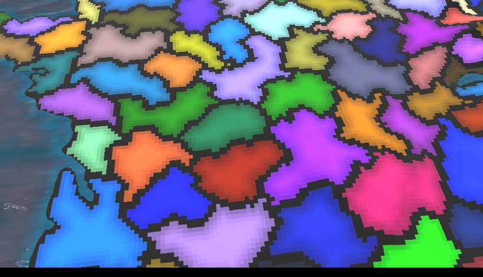
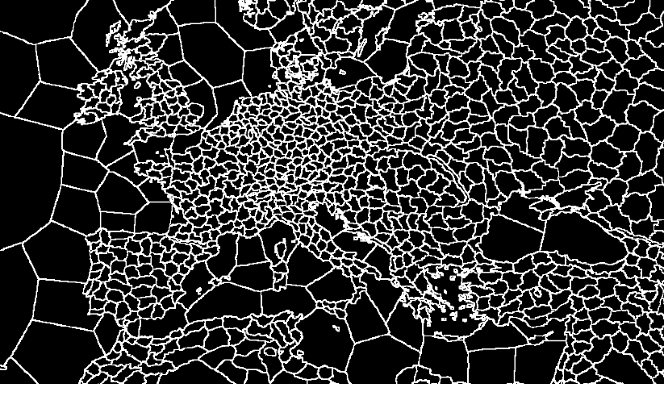
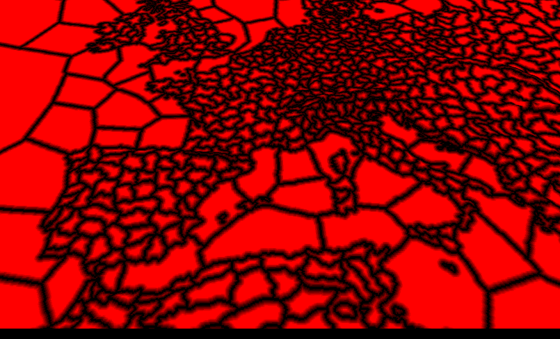

Most resources on the internet are providing information on how to create GTG games in an already established engine such as Unity, Godot or Unreal Engine. In this article, my aim is to make the ***rendering*** aspect of this genre easier to approach, thereby contributing towards the development of engines and tools that make the creation of GTGs more accessible.

In this article I will explain how to texture a procedural mesh used in typical Grand Strategy games, like Europa Universalis 4 (EU4). Keep in mind that this article serves more as a base to improve upon, rather than a complete solution for texturing.


## Prerequisites

I am going to use C++ and OpenGL for showcasing the concepts in code. I am expecting the reader has some understanding of graphics programming. I will not explain how to procedurally generate a mesh from this heightmap:


*Heightmap from EU4*

### Creating the mesh on the CPU

I will provide the sources I used to generate my own procedural mesh below:

- [OGLDEV](https://youtu.be/xoqESu9iOUE?si=HWXc-EfHuPOQWhgq)
- [LearnOpenGL](https://learnopengl.com/Guest-Articles/2021/Tessellation/Height-map)

> If you do not mind creating a low resolution mesh and downscaling or resizing the image to something smaller, you can skip this optimization step.
{: .prompt-warning }

### Optimizations

Dividing the mesh into patches and having different levels of detail (LOD) picked based on the camera distance is a common approach towards rendering the mesh more performant. I recommend trying [GeoMipMapping](https://www.youtube.com/watch?v=08dApu_vS4c) which creates LODs for patches on the CPU.

- [OGLDEV](https://www.youtube.com/watch?v=08dApu_vS4c)
- [paper](https://flipcode.com/archives/article_geomipmaps.pdf)

Another option is to use Tesselation Shaders. This will be a bit more advanced to set up with OpenGL, however, it might be faster than the previous option.

- [OGLDEV](https://youtu.be/GgW3MVOP8_A?si=E2KBs9SAsol77p3p)
- [LearnOpenGL](https://learnopengl.com/Guest-Articles/2021/Tessellation/Tessellation)

## Background

Grand Strategy games (GTG) are a niche genre that appeal only to a smaller portion of the strategy audience. Their complex simulations of the world make it a hard genre to get into as well as a difficult one to develop for. The complex systems that guide diplomacy, economy and even history are being utilized for more than just entertainment. The area of research around these games has become more active in the recent years. Grand Strategy games might also be "Serious Games" and will aid in teaching history, economy and medieval diplomacy. Here are a few research papers exploring these topics:

- [Grand Strategy Games As A Pedagogical Tool For Introductory Economics: A Student's Perspective](https://papers.ssrn.com/sol3/papers.cfm?abstract_id=4986923#paper-references-widget)
- [Simulating medieval connections Grand strategy games and social network analysis](https://jhnr.net/articles/81/files/660bbe5c7c0b0.pdf)
- [Grand Strategy Games and Economies](https://www.diva-portal.org/smash/get/diva2:1686298/FULLTEXT01.pdf)
- [Digitising Diplomacy: Grand Strategy Video Games as an Introductory Tool for Learning Diplomacy and International Relations](https://www.academia.edu/75509526/Digitising_Diplomacy_Grand_Strategy_Video_Games_as_an_Introductory_Tool_for_Learning_Diplomacy_and_International_Relations)

## Assets used in this tutorial

All maps, except for the layers, are from EU4 which you can download [here](https://eu4.paradoxwikis.com/Map_modding).
The layer textures can be found below, in the order that they are used:

- [first](https://polyhaven.com/a/coast_sand_02)
- [second](https://polyhaven.com/a/aerial_grass_rock)
- [third](https://polyhaven.com/a/rock_face)
- [forth](https://polyhaven.com/a/snow_02)

> To follow along you need a province and color map, as well as the layer pairs (diffuse + normal).
{: .prompt-info }

### Assets outline

This is a high level overview of all textures I used in my renderer. You can download all assets needed to follow along [here](#assets-outline).

.png)
_Diagram of assets used in the renderer_
## Texturing based on height

The easiest way I found to texture the whole terrain is based on the height. That means we need to provide some extra information for each vertex to the fragment shader. We define a number of layers; sand, grass, mountain and snow. A layer will have the following properties:

```cpp
//each vertex should pass its height to the fragment shader
in float height;
// used for selecting the correct layer properties
uniform vec2 min_max_height;

//layer properties
uniform vec3 base_colors[MAX_LAYERS]; 
//interpolate between color and texture, [0, 1]
uniform float base_color_stength[MAX_LAYERS]; 
//define where this layer starts and where the previous one ends, [0, 1]
uniform float base_heights[MAX_LAYERS]; 
//linear blend between this and the previous layer, [0, 1]
uniform float base_blends[MAX_LAYERS]; 
//will scale the uv coordinates of the texture
uniform float base_scale[MAX_LAYERS]; 
```

We can get the minimum and maximum when we are creating the buffers on the CPU, like so:

```cpp
  m_minMaxHeight = glm::vec2{FLT_MAX, -1.0f};
  for (uint32_t z = 0; z < height; ++z)
  {
      for (uint32_t x = 0; x < width; ++x)
      {
          auto h = heightValues[index];
          glm::f32 heightMinMax = static_cast<float>(h) / 255.0f;

          {
              // min height
              m_minMaxHeight.x = std::min(m_minMaxHeight.x, heightMinMax);

              m_minMaxHeight.y = std::max(m_minMaxHeight.y, heightMinMax);
          }

          //set vertex position
          //set uv
      }
  }
    
```

To map each layer, we need to get a percentage for the vertex height using the inverse lerp function. This percentage will define the draw strength using the blend, you can see how this looks below:


*No Blending*


*With Blending*

Shader code for getting the draw strength:

```cpp

float inverse_lerp(float a, float b, float value){
   return clamp((value-a)/(b-a),0.0,1.0);
}
//this function is based on this video from Sebastian Lague https://www.youtube.com/watch?v=XjH-UoyaTgs
void texture_terrain(out vec4 color, out vec3 normal)

  //[0, 1]
  float hPercent = inverse_lerp(min_max_height.x, min_max_height.y, height);

    for (int i = 0; i < MAX_LAYERS; i++){
        //get how much of this layer we should draw [0, 1]
        //EPSILON = a very small float to prevent divison by 0
        float drawStrength = inverse_lerp(-base_blends[i]/2 - EPSILON, base_blends[i]/2, hPercent - base_heights[i]);
        //early return
        if (drawStrength < EPSILON)
        {
            continue;
        }
        //color and texture albedo

        //normals

        //using draw strength for final color and normal
         
        }
```

All that is left to do is to get the color and normals from the texture. Since we need as many texture pairs as there are layers it would be better to reduce branching as much as possible. Below you can see the differences between `sampler2D` and `sampler2DArrays`. You can also use `texture atlases` to achieve the same thing.

```cpp
//diffuse
uniform sampler2D s_diff1;
uniform sampler2D s_diff2;
...
//normal
uniform sampler2D s_nor1;
uniform sampler2D s_nor2;
...
//vert uvs
in vec2 uv;

//to sample we do
vec4 value = texture(s_diff1, uv);

//we can use texture arrays and bundle all textures inside from the CPU
uniform sampler2DArray s_diffMap;
uniform sampler2DArray s_normMap;

//to sample we do
int i = Texture index we want to sample
vec4 value = texture(s_diffMap, vec3(uv,i));
```

### Creating texture arrays

To create texture arrays you can do:

```cpp
    // diffuse
    glGenTextures(1, &m_materialDifuseArray);
    glBindTexture(GL_TEXTURE_2D_ARRAY, m_materialDifuseArray);

    glTexParameteri(GL_TEXTURE_2D_ARRAY, GL_TEXTURE_MIN_FILTER, GL_LINEAR_MIPMAP_LINEAR);
    glTexParameteri(GL_TEXTURE_2D_ARRAY, GL_TEXTURE_MAG_FILTER, GL_LINEAR);
    glTexParameteri(GL_TEXTURE_2D_ARRAY, GL_TEXTURE_WRAP_S, GL_REPEAT);
    glTexParameteri(GL_TEXTURE_2D_ARRAY, GL_TEXTURE_WRAP_T, GL_REPEAT);
    glBindTexture(GL_TEXTURE_2D_ARRAY, 0);
    //the same for normals
```

Then you can add each texture to the proper texture array in the order they need to be rendered. Keep in mind, that before binding them, you need to do this once for each array at the start, or as soon as a texture array is changed (if you support texture changing at runtime):

```cpp
void bee::internal::ReadGLTexture(std::vector<uint8_t>& data, unsigned int index)
{
    const GLuint textureID = index;
    glBindTexture(GL_TEXTURE_2D, textureID);

    glGetTexImage(GL_TEXTURE_2D, 0, GL_RGBA, GL_UNSIGNED_BYTE, data.data());

    glBindTexture(GL_TEXTURE_2D, 0);
}
//you need to call for diffuse and normal array
void Renderer::FinalizeTextureArray(std::vector<std::shared_ptr<Texture>> textures, uint32_t arrayLocation)
{
  //the code assumes all textures have the same resolution
    const auto width = textures[0]->Image->GetWidth();

    const auto height = textures[0]->Image->GetHeight();

    glBindTexture(GL_TEXTURE_2D_ARRAY, arrayLocation);
    // diffuse and normal maps
    glTexStorage3D(GL_TEXTURE_2D_ARRAY, 1, GL_RGBA8, width, height, static_cast<GLsizei>(textures.size()));

    glTexParameteri(GL_TEXTURE_2D_ARRAY, GL_TEXTURE_MIN_FILTER, GL_LINEAR_MIPMAP_LINEAR);
    //the other glTexParameteri functions
    ...
    //all 4 channels RGBA
    std::vector<uint8_t> data(width * height * 4);

    for (int i = 0; i < textures.size(); ++i)
    {
        //will bind individual textures to be added to the array
        bee::internal::ReadGLTexture(data, textures[i]->Image->GetTextureId());

        glTexSubImage3D(GL_TEXTURE_2D_ARRAY, 0, 0, 0, i, width, height, 1, GL_RGBA, GL_UNSIGNED_BYTE, data.data());
    }

    // Generate mipmaps
    glGenerateMipmap(GL_TEXTURE_2D_ARRAY);
    glBindTexture(GL_TEXTURE_2D_ARRAY, 0);
}
```

Before rendering, binding them is pretty straightforward:

```cpp
void bee::internal::BindTextureArray(GLuint id, GLint location)
{
    glActiveTexture(GL_TEXTURE0 + location);
    glBindTexture(GL_TEXTURE_2D_ARRAY, id);

    glUniform1i(location, location);
}
//before drawing
bee::internal::BindTextureArray(m_materialDifuseArray, TEXTURE_ARRAY_LOCATION);
bee::internal::BindTextureArray(m_materialNormalArray, NORMAL_TEXTURE_ARRAY_LOCATION);

```

Below, there is the last part of the shader code when texturing the terrain with the layers.

```cpp
   //get our color
  vec3 baseCol = base_colors[i] * base_color_stength[i];
  //sample texture albedo
  vec4 textureColor = triplanar(v_position, v_normal, base_scale[i], s_diffMap,i) * (1.0 - base_color_stength[i]);
  //sample texture normal

  //final color
  color = color * (1.0 - drawStrength) + vec4((baseCol + textureColor.rgb) * drawStrength, 1.0);

  //final normal
  normal = normalize(mix(normal, textureNormal, drawStrength));

```


*Texturing by sampling the diffuse and normal textures with no texture scaling*


*Texturing by sampling the diffuse and normal textures with texture scaling*

The result looks somewhat better when we try scaling the textures by some factor. To make the texturing look better we can use triplanar mapping:


*Triplanar sampling for the diffuse and normal textures*

As the name implies, we have to sample each texture three times on each axis.

```cpp
vec4 triplanar(vec3 pos, vec3 normal, float scale, sampler2DArray textures, int idx){
    
    vec2 uv_x=(pos.zy*scale);
    vec2 uv_y=(pos.xz*scale);
    vec2 uv_z=(pos.xy*scale);
    

    vec4 dx = texture(textures, vec3(uv_x,idx));
    vec4 dy = texture(textures, vec3(uv_y,idx));
    vec4 dz = texture(textures, vec3(uv_z,idx));
    
    vec3 weights = abs(normal);

    // makes sure the values do not exceed 1
    weights = weights / (weights.x + weights.y + weights.z);
    
    return dx * weights.x + dy * weights.y + dz * weights.z;
}
```

To get the normals we are essentially doing the same thing we did above, however, we need to compute the tangent matrix which is a bit out of scope to explain properly here. If you want to get a deeper understanding I recommend reading [this](https://bgolus.medium.com/normal-mapping-for-a-triplanar-shader-10bf39dca05a) article by Ben Golus.

```cpp
//map the normals to [-1, 1]
vec3 unpack_normal(vec4 packedNormal){
    vec3 normal = packedNormal.rgb * 2.0 - 1.0;
    return normalize(normal);
}
//https://www.shadertoy.com/view/4t2SzR#
vec3 blend_rnm(vec3 n1,vec3 n2)
{
    n1.z +=1.0;
    n2.xy = -n2.xy;
    float denom = max(n1.z, 0.001);
    return n1 * dot(n1, n2) / n1.z - n2;
}
vec3 triplanar_normal(vec3 pos, vec3 normal, float scale, sampler2DArray textures,int idx){
    
    vec3 absNormal = abs(normal);
    
    vec3 weights = absNormal;

    // makes sure the values do not exceed 1
    weights = weights / (weights.x + weights.y + weights.z);
    
    vec2 uv_x = (pos.zy * scale);
    vec2 uv_y = (pos.xz * scale);
    vec2 uv_z = (pos.xy * scale);

    //the normal texture in [-1, 1] range
    vec3 tangentNormalX = unpack_normal(texture_UV (textures, vec3(uv_x, idx)) );
    //the other two axis
    
    //I am using reoriented normal mapping, but there are many ways to blend normals that you can try: https://blog.selfshadow.com/publications/blending-in-detail/

    tangentNormalX = blend_rnm(vec3(normal.zy,absNormal.x), tangentNormalX);
    tangentNormalY = blend_rnm(vec3(normal.xz,absNormal.y), tangentNormalY);
    tangentNormalZ = blend_rnm(vec3(normal.xy,absNormal.z), tangentNormalZ);
    
    vec3 axisSign = sign(normal);

    tangentNormalX.z *= axisSign.x;
    tangentNormalY.z *= axisSign.y;
    tangentNormalZ.z *= axisSign.z;
    
    vec3 outputNormal=normalize(
        tangentNormalX.zyx * weights.x +
        tangentNormalY.xzy * weights.y +
        tangentNormalZ.xyz * weights.z
    );
    
    return outputNormal;
}
```

As you may have already noticed, with Triplanar Mapping we have to do 6 more texture reads, which does affect performance substantially. I believe there are more efficient approaches to achieve the same thing, however, the simplicity of Triplanar Mapping makes it a decent solution for the time being.


*Color map from EU4*


_No color map applied_

We can enhance the look of our world by using a color map, which we can sample across the whole mesh.

```cpp
//stores the result in mat.albedo (vec4) and normal (vec3)
texture_terrain(mat.albedo, normal);
//we multiply the previous result by the texture color
mat.albedo = mat.albedo * texture(s_diffuse,v_texture);

```


*Color map applied*


## Creating borders from the province map


*Province map from EU4*

EU4 provides a handmade voronoi diagram where each province has a unique color. We can compute the edges by checking each pixel's neighbors, if they do not share the same color than we have an edge.

```cpp
vec4 CreateTerrainBorders(){
    float borderScale= 0.5;
    //we can use this factor to scale the borders
    vec2 texelSize = borderScale  / vec2(textureSize(s_provinceMap, 0));
    //province pixel color
    vec4 center = texture(s_provinceMap, v_texture1);
    //get pixels
    vec4 left = texture(s_provinceMap, v_texture1 + vec2(-texelSize.x, 0.0));
    vec4 right = texture(s_provinceMap, v_texture1 + vec2(texelSize.x, 0.0));
    vec4 up = texture(s_provinceMap, v_texture1 + vec2(0.0, texelSize.y));
    vec4 down = texture(s_provinceMap, v_texture1 + vec2(0.0, -texelSize.y));

    bool isEdge = any(notEqual(center, left)) || 
                any(notEqual(center, right)) || 
                any(notEqual(center, up)) || 
                any(notEqual(center, down));

    float provinceColorFactor = 0.6;
    //we are going to multiply by the previous color of the terrain
    vec4 color = isEdge ? mix(vec4(0.0), vec4(1.0), provinceColorFactor): vec4(1.0);

    return color;
}
```


*border scale of 0.2*


*border scale of 0.5*

### Making a "political" mode


*Filter set to nearest neighbor so the effect is easier to see*

Adding province borders is the same as before.

```cpp
vec4 CreatePoliticalBorders(){
    //exactly the same code as above
    ...
    //gradient code
    ...
    float provinceColorFactor = 0.6;
    //the edges will be a color between black and the province color
    vec4 color = isEdge? mix(vec4(0.0), center, provinceColorFactor) : center;
    //apply gradient
    ...
    //color will be set directly as the albedo
    return color;
}
```


*terrain with the province map and borders*

To create a gradient we are going to use compute shaders in OpenGL. If you have never used them before you can read [this](https://learnopengl.com/Guest-Articles/2022/Compute-Shaders/Introduction) article to get up to speed.

We need to create a new virtual image in OpenGL, after that we can go through the first pass, which will generate a texture with the province borders that we already rendered:

> We are doing the same work twice for the edge detection. Once every frame in the fragment shader, and once at the beginning of the application for the border texture. It would be better to apply some image processing for the border texture in order to replace the fragment shader edge detection.
{: .prompt-info }

```cpp
#version 460 core

layout (local_size_x = 1, local_size_y = 1, local_size_z = 1) in;
layout(rgba32f, binding = 0) uniform image2D imgOutput;
layout(binding = 1) uniform sampler2D s_provinceMap;

void main(){


    ivec2 pixelCoords = ivec2(gl_GlobalInvocationID.xy);
    
    ivec2 textureSize = textureSize(s_provinceMap, 0);
    
    vec2 texelSize = 1.0 / vec2(texSize); 
    vec2 uv = (vec2(pixelCoords) + 0.5) * texelSize; 
    
    // sample neighboring pixels
    vec4 center = texture(s_provinceMap, uv);
    vec4 left = texture(s_provinceMap, uv + vec2(-texelSize.x, 0.0));
    vec4 right = texture(s_provinceMap, uv + vec2(texelSize.x, 0.0));
    vec4 up = texture(s_provinceMap, uv + vec2(0.0, texelSize.y));
    vec4 down = texture(s_provinceMap, uv + vec2(0.0, -texelSize.y));
   
    
    // check if current pixel is on an edge
    bool isEdge = any(notEqual(center, left)) ||
                  any(notEqual(center, right)) ||
                  any(notEqual(center, up)) ||
                  any(notEqual(center, down));

    
    // write result to output image
    vec4 result = isEdge ? vec4(1.0): vec4(0.0);
    imageStore(imgOutput, pixelCoords, result);
}
```

The texture would look like this:



To run the compute shader we have to run the following code on the CPU:

```cpp
    
    m_bordersCompute->Activate();
    //bind the province map
    internal::SetTexture(provinceTexture, 1);
    //bind the output image
    glBindImageTexture(0, edgeDetectionTexture->GetTextureId(), 0, GL_FALSE, 0, GL_WRITE_ONLY, GL_RGBA32F);
    //start the compute
    glDispatchCompute(edgeDetectionTexture->Image->GetWidth(), edgeDetectionTexture->Image->GetHeight(), 1);
    //waits for the compute shader to finish
    glMemoryBarrier(GL_ALL_BARRIER_BITS);
```

To create a Distance Field texture we are going to use a naive approach to this that works well enough. We are going to encode the distance to the closest edge in each pixel by checking pixels around it based on a range variable.

```cpp
#version 460 core

//this is going to be slow without utilizing work groups
layout (local_size_x = 8, local_size_y = 8) in;
layout(binding = 0, rgba32f) readonly uniform image2D edgeMap;
layout(binding = 1, rgba32f) writeonly uniform image2D dfOutput;

void main() {
    ivec2 pixelCoords = ivec2(gl_GlobalInvocationID.xy);
    
    ivec2 texSize = imageSize(edgeMap);
    
    //early return
    if (pixelCoords.x >= texSize.x || pixelCoords.y >= texSize.y) {
        return;
    }
    
    //initialize the minimum distance
    float minDistance = float(texSize.x * texSize.y);
    //this is an approximation
    int range = 70;
    for (int y = -range; y <= range; ++y) {
        for (int x = -range; x <= range; ++x) {

            ivec2 neighborCoords = pixelCoords + ivec2(x, y);

            //outside the image
            if (neighborCoords.x < 0 || neighborCoords.x >= texSize.x ||
                neighborCoords.y < 0 || neighborCoords.y >= texSize.y) {
                continue;
            }
           float edgeValue = imageLoad(edgeMap, neighborCoords).r;
            
            //you would have to adjust the threshold if you are doing another blur pass on the edge texture
            if (edgeValue > 0.1) { 
                float distance = length(vec2(x, y));
                minDistance = min(minDistance, distance);
            }
        }
    }
    //write output
    //minDistance needs to be normalized for proper output in the fragment shader
    imageStore(sdOutput, pixelCoords, vec4(minDistance, 0.0, 0.0, 1.0));

}
```

To run the second pass we are doing nearly the same thing as before, with the addition of using the work groups for better performance.

```cpp
    m_sdTexture->Activate();

    glBindImageTexture(0, edgeDetectionTexture->GetTextureId(), 0, GL_FALSE, 0, GL_READ_ONLY, GL_RGBA32F);
    glBindImageTexture(1, outputTexture->GetTextureId(), 0, GL_FALSE, 0, GL_WRITE_ONLY, GL_RGBA32F);
    //in order to improve performance for this I am using work groups
    int numGroupsX = provinceTexture->Image->GetWidth() / 8 + 1;
    int numGroupsY = provinceTexture->Image->GetHeight() / 8 + 1;
    glDispatchCompute(numGroupsX, numGroupsY, 1);

    glMemoryBarrier(GL_ALL_BARRIER_BITS);
```




> This technique is something I wrote after reading [this](https://www.intel.com/content/www/us/en/developer/articles/technical/optimized-gradient-border-rendering-in-imperator-rome.html) paper on on how Imperator: Rome creates its gradient using a Distance Field texture.
{: .prompt-info }

Back in the fragment shader, we can add a sample from the Distance Field texture in order to get a gradient:

```cpp
{
    //same code as above
    ...
    //sample Distance Field texture and normalize
    float normalization = 20;
    float a = texture(s_bordersMap, v_texture1).r / normalization;
    //the texture might still have pixels that are not normalized due to the naive approach for creating it
    if(a > 1.0){
        a = 1.0;
    }
    //common way to sample a SDF texture
    //https://www.youtube.com/watch?v=1b5hIMqz_wM
    float thick= 0.8;
    float soft= 0.99;
    a = smoothstep(1.0 - thick - soft, 1.0- thick + soft, a);
    //apply the gradient
    color*=a;
    return color;
}

```

## Final Words and Future Ideas

In this article I wrote about texturing techniques common when creating a Grand Strategy renderer. At the time of writing, I was working on my university project at BUAS, in the CMGT, programming track. It spanned over eight weeks and it served as a basis for writing this article. I hope this was useful for you and if you would like to develop this further, here are some ideas:

- Pipeline for generating procedural grand strategy worlds (as in the New Worlds DLC from EU4)
- Rivers and lakes
- Foliage and cities
- Spline based borders


Thanks for reading my article. If you have any feedback or questions, please feel free to email me at <bogdan.game.development@gmail.com>.

