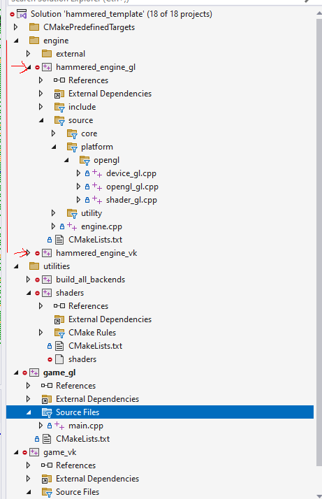
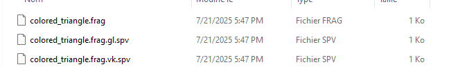

## Intro

At the end of my second year at university, I had the opportunity to work with custom game technologies. I contributed to cross-platform engines (each took 8 weeks) that ran on [Nintendo](https://tycro-games.github.io/projects/Y2-blockC/) and [PS5](https://tycro-games.github.io/projects/Y2-BlockD/). Over another 8 weeks, I built a [grand strategy renderer](https://tycro-games.github.io/projects/Y2-blockB/) inspired by one of my favorite games, *Europa Universalis IV*.

The experience was educational and practical; however, I often felt constrained by the strict deadlines. I had to compromise to finish on time, just as each project was starting to come together. This is why I decided to start my most ambitious solo project yet: **Hammered**, an engine using OpenGL and Vulkan for simulation games, where I can experiment with graphics, tools and gameplay systems at my own pace, building each addition on top of the last.

The project is available on github, specifically the branch used when this articles was made can be found [here](https://github.com/OneBogdan01/hammered-engine/tree/Cmake-opengl-vulkan-set-up).

## Demo

At this point in my development journey I am still trying to figure out a lot of unknowns. For the time being, I want to build a vulkan renderer and use OpenGL as a visual check. If it looks the same with both backend. I also had a long curiosity to experiment with performance on Vulkan and modern OpenGL. I never compared OpenGL with AZDO and Vulkan [^grc][^glAZDO][^GDCtalk] which is something that I am excited to explore (and profile!).

<video autoplay muted controls width="90%" src="/assets/assets-2025-07-19/2025-07-19 18-00-20.mp4" title="Title"></video>

*In the next updates, I will save the current state of the engine on close, automatically loading the state when switching between backends*

This is the breakdown, of what I have done so far:

- using Cmake[^make] I can generate two .exes that use OpenGL and Vulkan, "_gl" and "_vk" as name endings
- shaders are compiled in the generation step from .glsl to .spv into Vulkan and OpenGL specific binaries, as detailed in the Red Book, chapter two [^glb].
- running one of them, initializes the selected graphical backend with the following setup: a triangle is rendered, along with an imgui menu that allows changing the compute shader applied to the background
- an ImGui menu is also present to allow changing from one backend to another, closing the current instance and running the other executable


This setup was made using vulkan guide[^vkg], then adapted to OpenGL in order to have the same visual output. I would like to explain how I set-up Cmake for my project and the common "device" interface. I will not go into the graphics implementation yet, since I do not have a good grasp of how I want to build that API yet.


## Cmake

### What is it?

It is a popular cross-platform builder for C++ projects. The way it works is that it uses text files to define properties of the project. To get something working it is going to be quite basic, but I am also using a few more exotic features in order to make my life easier.

This can be the name of the project, what kind of cpp version you are using, linking external libraries, including source and header files. 

`CmakeLists.txt` files are  are used to write the building logic, I have several of these files at different levels of my project folders:

<video autoplay muted controls width="90%"  src="/assets/assets-2025-07-19/FolderStructure.mp4" title="Title"></video>

### Building the root

The `CmakeList.txt` that serves as the entry point:
```cmake
cmake_minimum_required(VERSION 3.24.0)

# Include utilities and other modules
# Hide inside global variables and useful functions
include(cmake_utility/utility.cmake)
project(hammered_template VERSION ${HM_VERSION})


# Backend selection, makes sure at least one is enabled
set(GAME_BACKENDS "")
# other code to allow the user to define the variable ...

# Adds engine code and externals
add_subdirectory(engine)

# This is where it compiles shaders to .spv
add_subdirectory(game)
# Sets up the backends .exes, GAME_BACKENDS is created in the engine folder
add_game_backends("${GAME_BACKENDS}")

# Set the Visual Studio startup project to the first enabled backend executable
list(GET GAME_BACKENDS 0 first_backend)
# This will be game_gl or game_vk
set_property(DIRECTORY PROPERTY VS_STARTUP_PROJECT "game_${first_backend}")
```
> The utility.cmake file can be found [here](https://github.com/OneBogdan01/hammered-engine/blob/6c75dfc19378b49ca015781f44a8b1a80146832e/cmake_utility/utility.cmake).
{: .prompt-tip }

### Building the engine target

Inside this folder there are another two: external and code. The cmake file below links everything together into two targets, each using OpenGL and Vulkan: `hammered_engine_gl` - `hammered_engine_vk`.
```cmake

# Add externals and code
add_subdirectory(external)
add_subdirectory(code)

# Iterate over each backend and add the right external libraries
foreach(backend ${GAME_BACKENDS})
    set(engine_target "hammered_engine_${backend}") # will end in _gl or _vk

    # Common libraries for all backends
    target_link_libraries(${engine_target}
        PUBLIC
            glm
            #and so on
    )

    # Backend-specific libraries
    if(backend STREQUAL "gl")
        target_link_libraries(${engine_target}
            PUBLIC
                glad
                imgui_opengl
        )
    elseif(backend STREQUAL "vk")
        target_link_libraries(${engine_target}
            PUBLIC
                vkbootstrap
                vma
                imgui_vulkan
        )
    endif()
    # Set Visual Studio folder
    set_target_properties(${engine_target} PROPERTIES FOLDER "engine")
endforeach()

```
All the targets inside `target_link_libraries` are going to be set in the external folder. This is why it is added above.
{: .prompt-info }

You might wonder why I set `set_target_properties`, I am using Visual Studio and I like to have my solutions organized in folders:


*resulting project hierarchy*

#### External

This is the folder with all libraries used by the engine, for now these are:
- sdl3
- vma
- stb_image
- vkbootstrap
- fmt
- glad
- imgui

I will skip most of the code that sets them up, but it can be found on the github repo [^source].
```cmake

# Header-only libraries
# ..

# vkbootstrap needs to be linked with vulkan

add_library(vkbootstrap STATIC)

target_sources(vkbootstrap PRIVATE 
  vkbootstrap/VkBootstrap.h
  vkbootstrap/VkBootstrap.cpp
  )

target_include_directories(vkbootstrap PUBLIC vkbootstrap)
target_link_libraries(vkbootstrap PUBLIC Vulkan::Vulkan $<$<BOOL:UNIX>:${CMAKE_DL_LIBS}>)
set_property(TARGET vkbootstrap PROPERTY CXX_STANDARD 20)
set_target_properties(vkbootstrap PROPERTIES FOLDER "engine/external")

# SDL3 has its own cmake files
add_subdirectory(SDL)  
get_property(SDL_TARGETS DIRECTORY ${CMAKE_CURRENT_SOURCE_DIR}/SDL PROPERTY BUILDSYSTEM_TARGETS)
# Add each SDL target to the externals
foreach(tgt IN LISTS SDL_TARGETS)
    if (TARGET ${tgt})
        set_target_properties(${tgt} PROPERTIES FOLDER "engine/external")
    endif()
endforeach()


# fmt
add_subdirectory(fmt)
set_target_properties(fmt PROPERTIES FOLDER "engine/external")
set_target_properties(fmt PROPERTIES FOLDER "engine/external")
# glad
add_library(glad STATIC ${CMAKE_CURRENT_SOURCE_DIR}/glad/src/glad.c)
target_include_directories(glad PUBLIC ${CMAKE_CURRENT_SOURCE_DIR}/glad/include)
set_target_properties(glad PROPERTIES FOLDER "engine/external")

```

The second part of this file is used to link common and per backend libraries:

```cmake
# Common imgui files, used by both backends
set(IMGUI_CORE
    imgui/imgui.cpp
    imgui/imgui_demo.cpp
    imgui/imgui_draw.cpp
    imgui/imgui_widgets.cpp
    imgui/imgui_tables.cpp
    imgui/backends/imgui_impl_sdl3.cpp
)

# Links imgui with SDL
add_library(imgui_core STATIC ${IMGUI_CORE})
target_include_directories(imgui_core PUBLIC ${CMAKE_CURRENT_SOURCE_DIR}/imgui)
target_link_libraries(imgui_core PUBLIC SDL3::SDL3)
set_target_properties(imgui_core PROPERTIES FOLDER "engine/external")

# Vulkan specific
if(ENABLE_VK_BACKEND) 
    add_library(imgui_vulkan STATIC
        imgui/backends/imgui_impl_vulkan.cpp
    )
    target_link_libraries(imgui_vulkan PUBLIC imgui_core Vulkan::Vulkan)
    set_target_properties(imgui_vulkan PROPERTIES FOLDER "engine/external")
endif()

# OpenGL specific
if(ENABLE_GL_BACKEND) 
# Same idea as above

# Disable library warnings
# ...

```

#### Code

> My code folder is further split into `include` and `source` , containing `.hpp` and `.cpp` files. 
{: .prompt-info }
To only include the right code files per backend, I exclude the `platform` folder for the `source` and `include`. Below you can see how I can filter the files:
```cmake
foreach(backend ${GAME_BACKENDS})
    set(target_name "hammered_engine_${backend}")

    # Gets every cpp file inside the source folder
    file(GLOB_RECURSE ALL_SOURCES CONFIGURE_DEPENDS
        ${CMAKE_CURRENT_SOURCE_DIR}/source/*.cpp
    )
    # Excludes all the source files in the platform folder
    list(FILTER ALL_SOURCES EXCLUDE REGEX ".*/platform/.*")

    set(ENGINE_SOURCES ${ALL_SOURCES})
    # Do the same for includes

```

Afterwards, I can get into the specific folder for each of the APIs:

```cmake
    # Backend-specific sources
    if(backend STREQUAL "gl")
        file(GLOB_RECURSE PLATFORM_SOURCES CONFIGURE_DEPENDS
            ${CMAKE_CURRENT_SOURCE_DIR}/source/platform/opengl/*.cpp
        )
        file(GLOB_RECURSE PLATFORM_HEADERS CONFIGURE_DEPENDS
            ${CMAKE_CURRENT_SOURCE_DIR}/include/platform/opengl/*.hpp
        )
        # define macro
        set(PLATFORM_DEFINE "GFX_USE_OPENGL")
    elseif(backend STREQUAL "vk")
    ## The same idea for vulkan

    list(APPEND ENGINE_SOURCES ${PLATFORM_SOURCES})
    list(APPEND ENGINE_HEADERS ${PLATFORM_HEADERS})

    add_library(${target_name} STATIC
        ${ENGINE_SOURCES}
        ${ENGINE_HEADERS}
    )

    target_include_directories(${target_name} PUBLIC
        ${CMAKE_CURRENT_SOURCE_DIR}/include
    )
    target_compile_features(${target_name} PUBLIC cxx_std_20)
    target_compile_definitions(${target_name} PUBLIC ${PLATFORM_DEFINE})


    # Visual Studio organization
    source_group(TREE ${CMAKE_CURRENT_SOURCE_DIR}/source PREFIX "source" FILES ${ENGINE_SOURCES})
    source_group(TREE ${CMAKE_CURRENT_SOURCE_DIR}/include PREFIX "include" FILES ${ENGINE_HEADERS})

    set_target_properties(${target_name} PROPERTIES FOLDER "engine")
endforeach()
```

### Building the shaders

At this point the engine is basically ready, each backend has its own library that has common libraries and specific ones depending if it is for OpenGL or Vulkan. The next step is to prepare the shaders. Normally, OpenGL uses `GLSL` which is compiled at run-time. However, there are extensions that allow OpenGL to use `.spv` files, which are prepared offline, as described in the **Red Book** in chapter two [^glb]. It is more to use the same `.glsl` file for Vulkan and OpenGL, the specific differences can be handled used `ifdef`. The last step is to compile to the Vulkan or OpenGL `.spv` variants, using the command line:

```
For opengl:
glslangValidator -G shader.vert -o output.spv
for vulkan:
glslangValidator -V shader.vert -o output.spv
```

>  I chose to put my shaders in the assets folder, which is inside the game folder. 
{: .prompt-info }
```cmake

find_program(GLSL_VALIDATOR glslangValidator HINTS /usr/bin /usr/local/bin $ENV{VULKAN_SDK}/Bin/ $ENV{VULKAN_SDK}/Bin32/)

file(GLOB_RECURSE GLSL_SOURCE_FILES
    "${ASSET_SOURCE_DIR}/shaders/*.frag"
    "${ASSET_SOURCE_DIR}/shaders/*.vert"
    "${ASSET_SOURCE_DIR}/shaders/*.comp"
    "${ASSET_SOURCE_DIR}/shaders/*.tesc"
    "${ASSET_SOURCE_DIR}/shaders/*.tese"
    "${ASSET_SOURCE_DIR}/shaders/*.geom"
    )

# Generate Vulkan and OpenGL SPIR-V for each shader
foreach(GLSL ${GLSL_SOURCE_FILES})
    get_filename_component(FILE_NAME ${GLSL} NAME)

if(ENABLE_VK_BACKEND)
    # Vulkan SPIR-V
    set(SPIRV_VK "${ASSET_SOURCE_DIR}/shaders/${FILE_NAME}.vk.spv")
    add_custom_command(
        OUTPUT ${SPIRV_VK}
        COMMAND ${GLSL_VALIDATOR} -V ${GLSL} -o ${SPIRV_VK}
        DEPENDS ${GLSL}
        COMMENT "Compiling Vulkan SPIR-V: ${FILE_NAME} -> ${SPIRV_VK}"
    )
    list(APPEND SPIRV_BINARY_FILES ${SPIRV_VK})
endif()
# The same as Vulkan but end with _gl and use the different command
endforeach()


add_custom_target(
    shaders
    DEPENDS ${SPIRV_BINARY_FILES}
)
# This target will be in the utilities folder
set_target_properties(shaders PROPERTIES FOLDER "utilities")
```

> This should ideally be moved to a script that is ran every time by the engine on start-up, in order to allow hot reloading of the shaders.
{: .prompt-tip }

The output for each shader will be:



These can then be loaded depending on the API.

### Building the executable
This code resides in the utlity.cmake file in order to not clutter the rest of the `CmakeLists.txt` files. It starts by settings some global settings and folders:
```cmake
# Configuring some global settings
set(CMAKE_EXPORT_COMPILE_COMMANDS ON)
set_property(GLOBAL PROPERTY USE_FOLDERS ON)
## Multithreaded enable for msvc

## Versioning
#...

## Setting the dlls and .exe in the same folder
set(CMAKE_ARCHIVE_OUTPUT_DIRECTORY ${CMAKE_BINARY_DIR}/lib/$<CONFIG>)
set(CMAKE_LIBRARY_OUTPUT_DIRECTORY ${CMAKE_BINARY_DIR}/bin/$<CONFIG>)
set(CMAKE_RUNTIME_OUTPUT_DIRECTORY ${CMAKE_BINARY_DIR}/bin/$<CONFIG>)


```

Then it copies the assets into the binary and solution folders, this allows for easy sharing of the executable, manually or by using CI/CD and it requires no further setup for running from Visual Studio.

```cmake
# Asset utility function
set(ASSET_SOURCE_DIR "${CMAKE_SOURCE_DIR}/game/assets")
function(configure_assets_for target)


    set(ASSET_BINARY_DIR "$<TARGET_FILE_DIR:${target}>/assets")
    set(ASSET_SOLUTION_DIR "${CMAKE_CURRENT_BINARY_DIR}/assets")

    add_custom_command(TARGET ${target} POST_BUILD
        COMMAND ${CMAKE_COMMAND} -E copy_directory
        "${ASSET_SOURCE_DIR}"
        "${ASSET_BINARY_DIR}"
    )
    add_custom_command(TARGET ${target} POST_BUILD
        COMMAND ${CMAKE_COMMAND} -E copy_directory
        "${ASSET_SOURCE_DIR}"
        "${ASSET_SOLUTION_DIR}"
    )
endfunction()
As I have shown before, I can open the OpenGL backend, close it, and open the Vulkan one. That requires each of the applications to know the path of the other one. In my case, I used a macro:
```cmake
# Generic addition of macro per backend as GAME_VK_EXECUTABLE_NAME="game_vk.exe" or GAME_GL_EXECUTABLE_NAME="game_gl.exe"
function(exec_macro_for target backend)
    foreach(backend IN LISTS backends)
        string(TOUPPER "${backend}" B_UP)
        target_compile_definitions(${target} PUBLIC
        "GAME_${B_UP}_EXECUTABLE_NAME=\"$<TARGET_FILE_NAME:game_${backend}>\""
            )
    endforeach()

endfunction()

Finally, we can generate all the backends applications. At the end, I also create a dummy target which will build both backends at the same time, so it does not have to be done manually:
```cmake
function(add_game_backends backends)
    set(game_exes)

    foreach(backend IN LISTS backends)
        message(STATUS "  Generating targets for backend = ${backend}")
        set(target "game_${backend}")
        set(engine "hammered_engine_${backend}")
        #TODO expand this for scripting, or structuring the game application
        add_executable(${target} game/src/main.cpp)
        target_link_libraries(${target} PRIVATE ${engine})
        add_dependencies(${engine} shaders)

        exec_macro_for(${target} "${backends}")
        exec_macro_for(${engine} "${backend}")

        set_property(TARGET ${target} PROPERTY CXX_STANDARD 20)
        configure_assets_for(${target})

        list(APPEND game_exes ${target})

    endforeach()

    # Set compiler flags
    #...
    This will try to build both backends when trying to run either applications:
    add_custom_target(build_all_backends ALL
        DEPENDS ${game_exes}
    )
    set_target_properties(build_all_backends PROPERTIES FOLDER "utilities")
endfunction()


```

## Device, implementation specific at compile time

Mention how pimpl or polymorphism takes a toll on the performance at runtime. And it seems weird?

## References

### OpenGL and Vulkan

[^glb]: [Red Book](https://www.amazon.com/OpenGL-Programming-Guide-Official-Learning/dp/0134495497)
[^grc]: [3D Graphics Rendering Cookbook: A comprehensive guide to exploring rendering algorithms in modern OpenGL and Vulkan](https://www.amazon.com/Graphics-Rendering-Cookbook-comprehensive-algorithms/dp/1838986197)
[^glAZDO]: [Indirect Rendering OGLDEV](https://www.youtube.com/watch?v=oETErEkFICE)
[^GDCtalk]: [GDC Talk](https://gdcvault.com/play/1023516/High-performance-Low-Overhead-Rendering)
[^vkg]: [Vulkan Guide chapter 3](https://vkguide.dev/docs/new_chapter_3/building_pipeline/)


[^make]: [Cmake](https://cmake.org/)

### Source

[^source]: [Github Repo to the branch used at the moment of writing](https://github.com/OneBogdan01/hammered-engine/tree/Cmake-opengl-vulkan-set-up)
