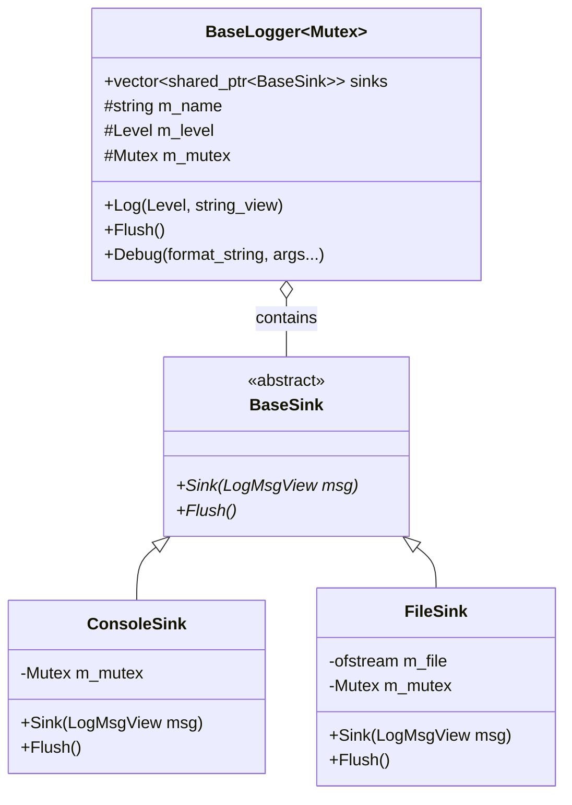
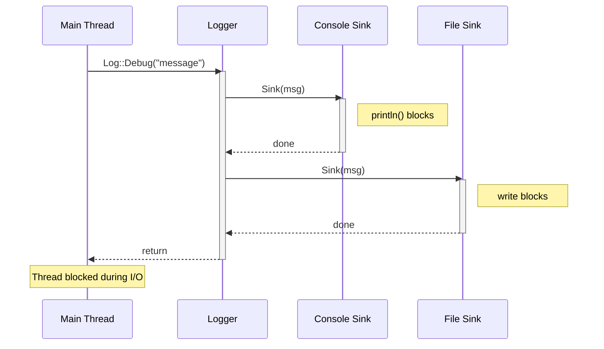
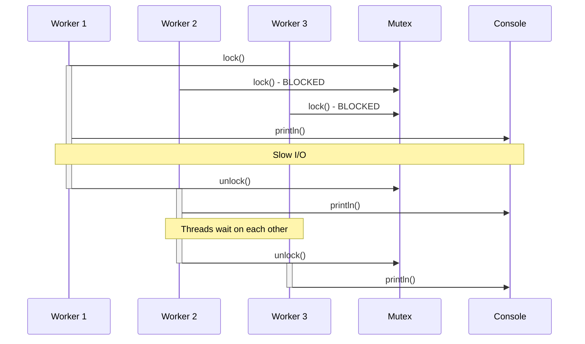
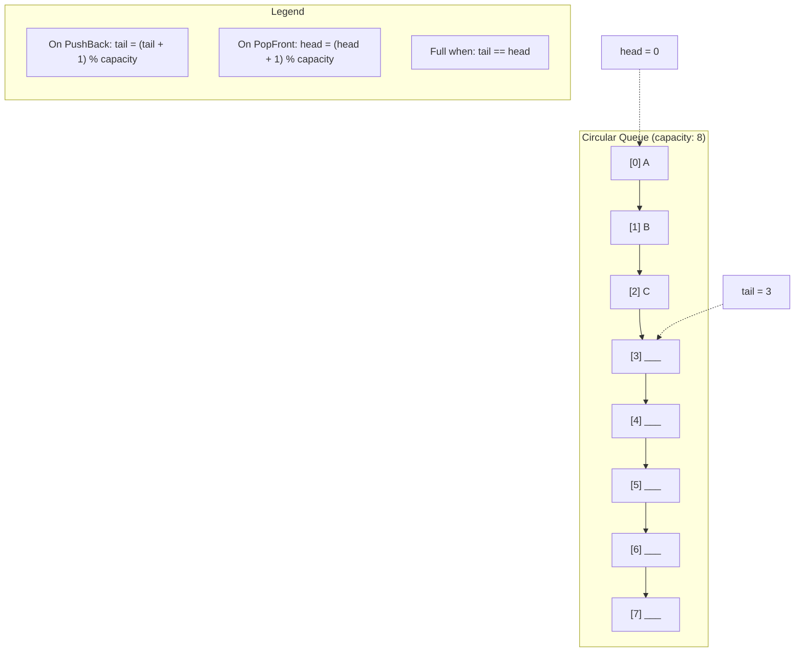
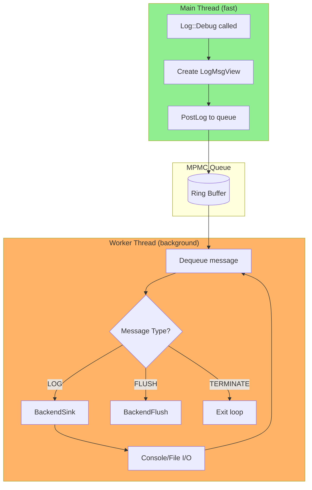
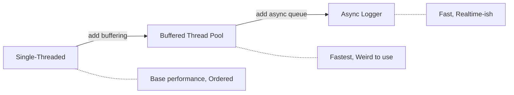

Logging is a pretty basic concept which you get exposed to quite early as a programmer. The most fundamental programming exercises are usually about logging to a console or to a file. Multithreading on the other hand, has always been something that had a complex aura around it. As my curiosity compels me to do, I aimed to make a small project where I could learn how to apply multithreading to logging.

If you need a production-ready solution, please use [spdlog][spdlog].

The project is open source. You can access the repo by clicking [here][hammered_repo].

## Preliminaries

In this section I mention what you need to know in order to better use the information provided. I am assuming a basic understanding of C++, I will not pay a lot of attention to implementation "details", but to overall ideas and concepts. I will try my best to provide comments or simplify the code, so the C++ code is easier to navigate.

### Multithreading Primitives

I am assuming an abstract understanding of mutexes, condition variables, atomics and mutex wrappers (`scoped_lock`, `unique_lock`) present in the standard library. If any of those are unclear, please check the links provided [here](#learning-resources).

### Test Environment

The way I test logging in order to compare it between single/multithreaded solutions is via aggressively logging from a 3D model loading function. In practice this will almost never be required, however, it is done in order to observe the performance of logging. I log both to console and file to compare the results. This serves as a way to check the results against the "ground truth", represented by the single-threaded output:

[log.txt](/assets/assets-2026-01-14/log.txt)

### About Hammered Engine

"Hammered" is a personal project of mine where I explore anything that piques my interest. Currently it uses C++23, however, the concepts discussed are not tied to C++ and could be applied to any other language.

## A Basic Logger with Sinks

A sink is an object that will process a message and "print" it. This could be a file called `log.txt`, or the console we all had to write to when learning to code. A sink is not necessarily only those two, but anything that can be written to as well as `flushed`. To `flush` means the function will return only after the message was written to the sink. As you can imagine, flushing is often the slowest part.

> This is why `endl` is not as fast as using `\n`; `endl` will also flush the console buffer, which is way slower than only doing a newline.
{: .prompt-info }



We can use an abstract class as our blueprint for making various kinds of sinks:

```cpp
struct BaseSink
{
  virtual ~BaseSink() = default;
  virtual void Sink(LogMsgView msg) = 0;
  virtual void Flush() = 0;
};
```

To call the sink object we need to pass a `LogMsgView`, an object that has the message we want to send and any other information we might find useful. One could add or remove as much as they need:

```cpp
struct LogMsgView
{
  Level level; // Debug, Warning, Error etc.
  std::string_view loggerName; // could have multiple loggers, each could have the same or different sinks, so it is important to differentiate between them
  std::string_view payload; // the message!
  time_point timestamp; // useful for debugging
  std::thread::id threadId; //only relevant in a multithreaded context
};
```

> C++ uses the concept of a `string_view`, you can think of this as a read-only pointer to a string object with some utility functions and size of the string.
{: .prompt-info }

Note that there may be times when different wrappers for log messages are needed. The one above does not own its message, and uses a read-only approach, which has the advantage of no-memory allocations for the string it holds. However, one may need another object that owns the `string` it holds.

To build a logger, one needs to wrap the sinks inside an API that allows the user to call the basic `sink` and `flush` functions. A few templated functions will also help us make a thread-safe and a non-thread-safe version.

Below I am using `scoped_lock` which is used to acquire and release it the mutex when the object lifetime goes out of scope.

```cpp

//this is a struct that makes the mutex be accepted to strip thread-safeness
struct NullMutex
{
  void lock() {}
  void unlock() {}
  bool try_lock() { return true; }
};

template<typename Mutex>
struct BaseLogger
{
  virtual ~BaseLogger() = default;
  virtual void Log(Level level, std::string_view msg)
  {
	//can set the level to higher to filter messages
    if (level < m_level) 
      return;

	//create our message
    LogMsgView view {.level = level,
                     .loggerName = m_name,
                     .payload = msg,
                     .timestamp = clock::now(),
                     .threadId = std::this_thread::get_id()};


	//only one thread can log one logger object at a time
    std::scoped_lock lock(m_mutex);

    for (const auto& sink : sinks)
    {
      sink->Sink(view);
    }
  };

  virtual void Flush()
  {
	//only one thread can flush one logger object at a time

    std::scoped_lock lock(m_mutex);
    for (const auto& sink : sinks)
    {
      sink->Flush();
    }
  }

  template<typename... T>
  void Debug(std::format_string<T...> fs, T&&... args)
  {
	//profiling function from Tracy
    HM_ZONE_SCOPED_N("Log::Debug");
    Log(Level::Debug, std::format(fs, std::forward<T>(args)...));
  }
  //other functions like debug

	//sinks can be added here via polymorphism
  std::vector<std::shared_ptr<BaseSink>> sinks;

 protected:
  std::string m_name {"LoggerName"};
  Level m_level {Level::Debug};
  //null or std::mutex
  Mutex m_mutex;
};
//shorthands
//thread-safe
using LoggerMt = BaseLogger<std::mutex>;
//single-threaded, no overhead
using LoggerSt = BaseLogger<NullMutex>;

```

> `Mutex` can be either `std::mutex` which makes the code thread safe, or `NullMutex` which is an empty implementation of a mutex construct. This makes it so C++ removes all the multithreading primitives and removes the overhead associated with it.
{: .prompt-info }


```cpp
template<typename Mutex>
struct ConsoleSink : BaseSink
{
  void Sink(LogMsgView msg) override
  {
    HM_ZONE_SCOPED_N("ConsoleSink::Sink");
  
    std::scoped_lock lock(m_mutex);
    std::println("{}", msg.payload);
  }

  void Flush() override
  {
    HM_ZONE_SCOPED_N("ConsoleSink::Flush");

    std::scoped_lock lock(m_mutex);
    std::cout.flush();
  }

 private:
  // allows us to see contention for this lock in Tracy
  // this is equivalent to:
  // Mutex m_mutex;
  HM_LOCKABLE_N(Mutex, m_mutex, "ConsoleSink");
};

// File sink is exactly the same, except for the code handling the file
template<typename Mutex>
struct FileSink : BaseSink
{
  explicit FileSink(const std::string& fileName) : m_file(fileName) {}

  void Sink(LogMsgView msg) override
  {
    HM_ZONE_SCOPED_N("FileSink::Sink");
    std::scoped_lock lock(m_mutex);
    m_file << std::format("{}\n", msg.payload);
  }

  void Flush() override
  {
    HM_ZONE_SCOPED_N("FileSink::Flush");
    std::scoped_lock lock(m_mutex);
    m_file.flush();
  }

 private:
  std::ofstream m_file;
  HM_LOCKABLE_N(Mutex, m_mutex, "ConsoleSink");
};
```

> `HM_ZONE_SCOPED_N` marks a profiling zone in Tracy. `HM_LOCKABLE_N` wraps a mutex so Tracy can visualize lock contention. These are thin wrappers around Tracy's C++ API.
   {: .prompt-info }

Then we can create a new logger that logs both to file and console like so:

```cpp
  auto logger = std::make_shared<LoggerSt>();
  logger->sinks.push_back(std::make_shared<ConsoleSinkSt>());
  logger->sinks.push_back(std::make_shared<FileSinkSt>(path));
```

The `log` function can then be use to log to both sinks, a global logger object and helper functions could be written, below is an example:

```cpp

// macro that selects which logger to define as DefaultLogger
#define HM_LOGGER_TYPE 0

#if HM_LOGGER_TYPE == 0
using DefaultLogger = LoggerSt;
#elif HM_LOGGER_TYPE == 1
using DefaultLogger = AsyncLogger;
#endif
inline std::shared_ptr<DefaultLogger>& GetGlobalLogger()
{
  static std::shared_ptr<DefaultLogger> instance;
  return instance;
}

inline void SetDefaultLogger(std::shared_ptr<DefaultLogger> logger)
{
  //move is a more efficient way to "assign" variables in C++
  GetGlobalLogger() = std::move(logger);
}

inline std::shared_ptr<DefaultLogger> GetDefaultLogger()
{
  return GetGlobalLogger();
}

template<typename... T>
void Info(std::format_string<T...> fs, T&&... args)
{
  if (auto logger = GetDefaultLogger())
    logger->Info(fs, std::forward<T>(args)...);
}
```



Running Tracy on our load function for this logger will give us the following results:


If you want to inspect the file yourself using Tracy:

[single_thread.tracy](/assets/assets-2026-01-14/single_thread.tracy)

Here we can see that our main logging function, which is `Log::Debug` is mainly taking most of the time on the "sink" of the console. This happens because the function will wait for `println` to return. Now the important question: Will multithreading make it faster?

### Thread Pool

We could try to multithread this directly via a `ThreadPool`:

```cpp
#pragma once
#include <mutex>
#include <queue>
namespace hm
{
// based on
// https://stackoverflow.com/questions/15752659/thread-pooling-in-c11
class ThreadPool
{
 public:
 //constructors ...
  //generic jobs, can be anything
  void QueueJob(const std::function<void()>& job);
  //make sure that all threads are done with their work and join them
  void Shutdown();
  //are any jobs still being done?
  bool Busy();

 private:
  std::vector<std::thread> m_threads;
  //
  std::atomic<u32> m_activeJobs;
  //while loop that keeps spinning
  void ThreadLoop();
  bool should_terminate = false; // Tells threads to stop looking for jobs
  std::mutex queue_mutex; // Prevents data races to the job queue
  std::condition_variable mutex_condition; // Allows threads to wait on new jobs or termination
  std::queue<std::function<void()>> jobs;
};
} // namespace hm

```

This class aims to provide a general way to multithread various tasks. It works under a few rules of thumb in multithreading:

- it is best to not create more threads than the number of hardware threads we support; `std::thread::hardware_concurrency()`
- creating new threads is slow, therefore, we initialize them once and then put them to sleep while we have no work; this is what happens in the `ThreadLoop` also known as `WorkerLoop`
- threads that are always active with no work to do are "punished" by the OS, our application may get less time because of that and suffer a performance hit; a condition variable is used to put all threads to sleep and wake one up when work is available
- a mutex is needed when accessing the queue of jobs, otherwise we might get critical data races which will make the behaviour of our programme non-deterministic at best and crash at its worst
- on `Shutdown` we should finish all the jobs in the queue, then join all the threads together.

> I am deliberately omitting the implementation of this generic `ThreadPool`, because I would like to explain in detail how a specialized thread pool could work for the async logger. If you are still curious you can find the `.cpp` file [here](https://github.com/OneBogdan01/hammered/blob/b7f02d68582e81e534c6a6183b8724575e26d28f/engine/code/source/thread/thread_pool.cpp).
{: .prompt-tip }

The hot-spot for logging messages becomes:

```cpp
pool.QueueJob(
                  [i, idx = indices.back()]()
                  {
                    log::Debug("    Index[{}]: {}", i, idx);
                  });
```

> This is a lambda, that allows us to queue the logging as a job.
{: .prompt-info }

The result is orders of magnitude slower, not only that, but our output is no longer in the correct order.


[log_multithreaded.txt](/assets/assets-2026-01-14/log_multi.txt)

The contention between threads is making them wait on each other. The overhead is obviously bigger than the single-threaded result, as mutex and the other primitives have a noticeable overhead.




 We could have much faster results by reducing the time it takes to log a message. The correct order is also possible if we pass the timestamp from the main thread before queuing the `ThreadPool`.

```cpp
 auto ts = log::clock::now();
              pool.QueueJob(
                  [i, idx = indices.back(), ts]()
                  {
                    log::Debug(ts, "    Index[{}]: {}", i, idx);
                  });
```

Despite the clunky API for passing the time to a function about logging, we are nearly done optimizing it. I created a new `SortedLogger` that inherits from the `BaseLogger` class. This will only add messages to a `std::vector` and only on the `Flush` call it is going to sort and call the slow `Sink` functions. It is important that now we have an owning `std::string` of our message, otherwise we will get invalid data when the string that was passed goes out of scope.

```cpp
//LogMessage uses a std::string
std::vector<LogMessage> buffer;

//we need to pass the time if we want the correct order
  void Log(Level level, std::string_view msg, time_point ts)
  {
    if (level < m_level)
      return;
    LogMsgView view {.level = level,
                     .loggerName = m_name,
                     .payload = msg,
                     .timestamp = ts,
                     .threadId = std::this_thread::get_id()};
    std::scoped_lock lock(m_mutex);
    //we do not log now, but add to a vector of messages
    buffer.emplace_back(view);
  }
  void Flush() override
  {
    //on flush we sort all messages based on the timestamp
    std::scoped_lock lock(m_mutex);
    std::sort(buffer.begin(), buffer.end());
    //now we call the sink function
    for (const auto& msg : buffer)
    {
      for (auto& sink : sinks)
      {
        sink->Sink(msg);
      }
    }
    //clear buffer and flush all sinks
  }
```

//TODO visualization with contention between threads


 What we lose is the real-time output from earlier. To even get the output, we have to rely on the user to call the `Flush` after the thread-pool has finished all its tasks.

 ```cpp
// ThreadPool.Busy() returns false, so all tasks are done
indexLogger.Flush(); // Outputs sorted by timestamp
```

At least the order is the same as in the single-threaded one. This could be made even faster, since I did not even pre-allocate memory for our buffered vector.
[log_multithreaded_correct_order](/assets/assets-2026-01-14/log_multi_correct_order.txt)

This approach is marked as yellow (faster), compared to single-threaded which is red (slower):


The buffered approach fits well with separate threads with subsystem multithreaded architectures: AI, physics, rendering etc., each maintaining their own buffered logger, flushing at the end of the frame. Otherwise, it is a cumbersome API for anything else. This is 

Before tackling the async logger, one should understand its core data structure: the circular queue (also called a ring buffer).

## Circular Queue

This library uses a circular queue wrapped with thread safety and pre-allocated memory in order to avoid reallocations at runtime. The main concept that is used in async logging is to separate `queueing` of messages from writing them to the `sink`. They offer three overflow policies when the queue is full:

- **Block**: The calling thread waits until space becomes available
- **Discard New**: New messages are dropped if the queue is full; existing messages are preserved
- **Overwrite Oldest**: New messages overwrite the oldest unprocessed messages in the queue

This is one of the reasons a circular queue is used. It handles what happens when the memory allocated is full. A circular queue maintains a fixed-size buffer with `head` (next element to pop) and `tail` (next empty slot) indices that wrap around. In the constructor, the maximum capacity is increased by one to keep track if the queue is full. This means that when the `tail` index is equal to the `head`, the queue has run out of space. When overwriting, both indices are advanced following each other in a circular manner.



```cpp
template<typename T>
class CircularQueue
{
 public:
  explicit CircularQueue(u64 maxItems)
      : m_maxItems(maxItems + 1),
        m_buffer(m_maxItems) // one item reserved as marker for full queue
  {
  }
  void PushBack(T&& item)
  {
    //assume queue capacity is valid before calling this

    m_buffer[m_tail] = std::move(item);
    m_tail = (m_tail + 1) % m_maxItems;
    // if full, overwrite oldest element
    if (m_tail == m_head)
    {
      m_head = (m_head + 1) % m_maxItems;
      ++m_overrunCount;
    }
  }
  // ...
 private:
  u64 m_maxItems = 0;
  u64 m_overrunCount = 0;
  u64 m_head = 0;
  u64 m_tail = 0;
  std::vector<T> m_buffer;
};

```

### ThreadPool for logging



Similar to the generic `ThreadPool` shown previously, this implementation uses mutexes and condition variables to ensure thread safety. A wrapper can be built around the `CircularQueue` in order to make it thread safe and still have a version without the overhead. `Spdlog` uses a `mpmc_blocking_queue` to offer this flexibility. It implements the three overflow policies mentioned earlier, applied to `Enqueue` and `Dequeue`. For brevity only the blocking version of these two is written in code below.

> MPMC stands for multi producer multi consumer, and means that it will be thread safe for multiple threads to write and read at the same time.
 {: .prompt-info }

```cpp

  // blocking dequeue without a timeout.
  void Dequeue(T& popped_item)
  {
    HM_ZONE_SCOPED_N("LogQueue::Dequeue");
    {
      // unique_lock will allow the condition variable to lock/unlock the mutex
      std::unique_lock lock(m_queueMutex);
      // if queue is empty, wait
      m_pushCV.wait(lock,
                    [this]
                    {
                      return !this->m_queue.Empty();
                    });
    
      popped_item = std::move(m_queue.Front());
      m_queue.PopFront();
    }
    m_popCV.notify_one();
  }

  // try to enqueue and block if no room left
  void Enqueue(T&& item)
  {
    HM_ZONE_SCOPED_N("LogQueue::Enqueue");
    {
      std::unique_lock lock(m_queueMutex);
      m_popCV.wait(lock,
                   [this]
                   {
                     return !this->m_queue.Full();
                   });
      m_queue.PushBack(std::move(item));
    }
    m_pushCV.notify_one();
  }
```

An important aspect of this thin wrapper is that it uses condition variables for `push` and `pop` actions that are separate. This improves performance by only waking up threads that have work to do, rather than all waiting threads. This is then used by a specialized `ThreadPool` which deals with logging. This owns the `mpmc` construct, and is similar otherwise to the previous pool used in the buffered approach.

The "worker loop" in this case is responsible for processing messages from the queue. Messages can have types and are required to use `std::string`, rather than their non-allocating counterpart: `std::string_view`. Otherwise, we may get invalid data.

```cpp
bool hm::log::LogThreadPool::ProcessNextMsg()
{
  HM_ZONE_SCOPED_N("ProcessLogMsg");
  AsyncMessage incoming_msg;
  m_queue.Dequeue(incoming_msg);

  switch (incoming_msg.type)
  {
    case AsyncMessageType::LOG:
      incoming_msg.asyncLogger->BackendSink(incoming_msg.msg);
      return true;
    case AsyncMessageType::FLUSH:
      //manual flush
      incoming_msg.asyncLogger->BackendFlush();
      return true;
      //this will make it so it waits for all threads to finish their work before shutdown
    case AsyncMessageType::TERMINATE:
      return false;
  }
  return true;
}
```

> An implementation detail worth noting: `AsyncMessage` owns the `AsyncLogger` via `shared_ptr`. This handles the scenario where a logger is destroyed while messages referencing it still exist in the queue.
{. prompt-info }

The `AsyncLogger` still inherits from the same base class as the other loggers in my project. The main `Log` function has changed to sending the message to the `LogThreadPool` as below. The `PostAsyncMsg` inside `LogThreadPool` is very similar to its `Process` counterpart with the only difference that instead of using the `Pop` functions, it uses the `Push` ones.

```cpp
void AsyncLogger::Log(Level level, std::string_view msg)
{
  HM_ZONE_SCOPED_N("AsyncLogger::Log");
  if (level < m_level)
    return;

  LogMsgView view {.level = level,
                   .loggerName = m_name,
                   .payload = msg,
                   .timestamp = clock::now(),
                   .threadId = std::this_thread::get_id()};

  //get the log thread pool and handle what to do if it is not initialized
  if (pool)
  {
    pool->PostLog(shared_from_this(), view, m_overflowPolicy);
  }
}
```

### Performance Comparison

The tests below were performed with a very large allocated queue (8192 * 5 = 40960) and only one worker thread. This was chosen as one consumer thread guarantees the same order of logs and minimizes thread contention, although I have not explored the possibility of more than one background thread due to lack of time.


_Log::Debug is considerably faster with async logger (yellow) than single-threaded logging (red)_

In Tracy you can clearly see when the main thread finished sending all the messages and the other thread is still processing them later at runtime.


_Timeline showing main thread finishing logging related calls while worker thread continues processing queued messages_

This is the same graph for the async approach. You can notice how overall the calls are marginally under 1 second, however, the `Log::Debug` is taking considerably less, because it is not tied to the console sink anymore.


_Flame graph, async logger_

In conclusion, an async logger provides a flexible and performant solution for lots of logging. It decouples expensive I/O operations from the calling thread while maintaining control through manual flushing for critical messages and configurable overflow policies to handle memory.



## References

### Libraries & Tools

- [spdlog][spdlog] — Fast C++ logging library
- [Tracy Profiler][tracy] — Frame profiler

### Books

- *Game Engine Architecture* by Jason Gregory — The multithreading chapter
- *C++ Concurrency in Action* by Anthony Williams

### Learning Resources

- [Mike Shah's Multithreading Series][mike_shah] — YouTube playlist
- [cppreference — Thread support library][cppreference_thread]

[spdlog]: https://github.com/gabime/spdlog
[tracy]: https://github.com/wolfpld/tracy
[hammered_repo]: https://github.com/OneBogdan01/hammered
[mike_shah]: https://www.youtube.com/playlist?list=PLvv0ScY6vfd9wBHRBmWh7EvAHYbqH9NRV
[cppreference_thread]: https://en.cppreference.com/w/cpp/thread

## Final Words

I made this article based on a self study project I did as a third year programmer at Breda University of Applied Sciences for the Creative Media and Game Technologies bachelor.
Thanks for reading my article. If you have any feedback or questions, please feel free to email me at <bogdan.game.development@gmail.com>.
