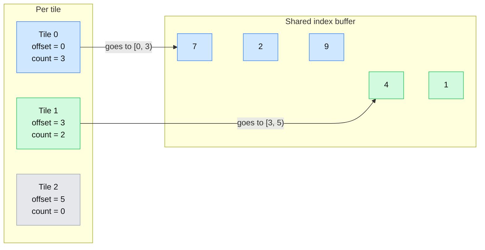

I was just finishing up my third year of university and I was on the lookout for a light project. I wanted to learn something interesting that entailed some graphics programming with SDL GPU.[^sdl] Inspired by this very interesting talk[^talk] about using SDF functions applied to UI rendering for the Decima editor, I decided that a quick excursion into the realm of rendering using math functions was appropriate to finish the year on a different note. I also indulged in an optimization most often used in lighting: tiled rendering.[^tiled]

I am assuming the reader knows C++ and OpenGL, but has limited understanding of modern graphics APIs like Vulkan, DX12, etc. SDL GPU is a thin abstraction over modern graphics APIs that I am going to use in this article. The code I use will not compile and it is kept short for ease of understanding. I will also skip most of the SDL initialisation logic, you can find it in the source code or use the examples I linked here.[^gpu_examples]

## Source Code

You can find the code used in this article [here](https://github.com/OneBogdan01/hammered/tree/main/demos/alloy_ui).

## Rendering an SDF

SDFs or Signed Distance Functions are the basis for ray marching, and Inigo Quilez's blog has all the information you need to properly understand the topic.[^sdf] Concisely, there is a function that gets called for each pixel on the screen and it returns a distance from the edge. According to a convention, positive numbers will be outside the shape, negative inside. If the distance is 0, then it is exactly on the edge of the shape. As an example, below is a rectangle drawn like that. Red means it is outside, light blue inside and right on the edge is a darker blue.

<video controls autoplay muted loop playsinline src="/assets/media/alloy/sdf_rect_v2.mp4" title="An SDF rectangle"></video>

The first step is to prepare our vertex data. This is a 2D rendering project, so while this may come as a surprise I am going to render a triangle that covers the whole screen. SDL GPU has a pretty verbose pattern, nothing that compares with rendering a triangle in Vulkan. To upload the "screen", an `SDL_GPUBuffer` is needed. This is used to define the size and usage, in our case a triangle has 3 vertices and it is used in a vertex shader. A transfer buffer is what you put your CPU data in, while it is in a mapped state. Afterwards, you unmap it, which means you cannot modify it anymore from the CPU and it is ready to be sent to the GPU. To upload things a copy pass is needed, then one can finally combine all of this together and submit it.

```cpp
//pointers from SDL need to be saved somewhere:
SDL_GPUGraphicsPipeline* pipeline;
SDL_GPUBuffer* vertex_buffer;
//humble 3D point for the triangle
struct Vertex {
    float x, y, z;
};

// There is quite some code before you can make a pipeline, check the SDL examples

pipeline = SDL_CreateGPUGraphicsPipeline(gpu_device->gpu_device, &pipeline_create_info);

// Release shaders

// Create the vertex buffer
SDL_GPUBufferCreateInfo buffer_create_info{.usage = SDL_GPU_BUFFERUSAGE_VERTEX,
                                            .size = sizeof(Vertex) * 3};
vertex_buffer = SDL_CreateGPUBuffer(gpu_device->gpu_device, &buffer_create_info);

// To get data into the vertex buffer, use a transfer buffer. This is the bridge between CPU and GPU.
SDL_GPUTransferBufferCreateInfo buffer_info{.usage = SDL_GPU_TRANSFERBUFFERUSAGE_UPLOAD,
                                            .size = sizeof(Vertex) * 3};
auto* transfer_buffer = SDL_CreateGPUTransferBuffer(gpu_device->gpu_device, &buffer_info);

Vertex* transfer_data = static_cast<Vertex*>(
    SDL_MapGPUTransferBuffer(gpu_device->gpu_device, transfer_buffer, false));

// our triangle will cover the whole screen like this
transfer_data[0] = Vertex{-1, 1, 0}; //upper left
transfer_data[1] = Vertex{-1, -3, 0}; //outside screen left
transfer_data[2] = Vertex{3, 1, 0}; //outside screen right

SDL_UnmapGPUTransferBuffer(gpu_device->gpu_device, transfer_buffer);

// Upload the transfer data to the vertex buffer
SDL_GPUCommandBuffer* upload_cmd_buf = SDL_AcquireGPUCommandBuffer(gpu_device->gpu_device);

// A copy pass is what is needed to upload data from CPU to GPU.
SDL_GPUCopyPass* copyPass = SDL_BeginGPUCopyPass(upload_cmd_buf);

SDL_GPUTransferBufferLocation buffer_location{.transfer_buffer = transfer_buffer,
                                              .offset = 0};
//matches the GPU Buffer made earlier
SDL_GPUBufferRegion buffer_region{
    .buffer = vertex_buffer, .offset = 0, .size = sizeof(Vertex) * 3};
SDL_UploadToGPUBuffer(copyPass, &buffer_location, &buffer_region, false);

// end copy pass, submit and release transfer buffer
```

## Basic Shaders

All will be written in `hlsl`. Keep in mind that SDL has a library for translating between shading languages, so you pick whatever your heart demands.[^shader_cross]

The terribly complicated vertex shader and the more interesting fragment shader:

```hlsl
//vertex
struct Input
{
    float3 Position : TEXCOORD0;
};

struct Output
{
    float4 Position : SV_Position;
};

Output main(Input input)
{
    Output output;
    output.Position = float4(input.Position, 1.0f);
    return output;
}

//fragment
//uniform buffer for the moving effect

float sdBox( float2 p, float2 b)
{
    float2 d = abs(p)-b;
    return length(max(d,0.0)) + min(max(d.x,d.y),0.0);
}
float sdCircle( float2 p, float b )
{
    return length(p)-b;
}
float4 main(float4 screenSpace : SV_Position) : SV_Target
{
    float2 uv = screenSpace.xy;
    float2 rect_pos = float2(.2,.5);
    float2 rect_size = float2(.4,.3);
    float2 circle_pos = float2(.6,.5);

    float d = sdBox(uv - rect_pos, rect_size) - 0.2;
    d = min(d, sdCircle(uv - circle_pos, .5));

    //choose a color if it is negative, positive or too close to 0
    float3 col = //...

    return float4(col, 1);
}
```

I went ahead and used the minimum between two different shapes in the fragment shader. This creates a very interesting effect that you get when you use SDF for rendering. You can composite shapes together in this way or subtract them. There are a lot more fancy functions for this that you can find here.[^sdf_min]

Here is one experiment I have done with `min` and `max` distances.

<video controls autoplay muted loop playsinline src="/assets/media/alloy/sdf_shapes.mp4" title="Compositing SDF shapes"></video>

## A Command Buffer for all UI Shapes

The easiest method that can be applied is to create a buffer that stores all shapes. The way this will be uploaded to the GPU is identical to the vertex buffer, except for the different configs. I chose to support a limited, but iconic repertoire of shapes:

```cpp
struct alignas(16) UICommand {
    UICommand(Circle circle, uColor32 color);
    UICommand(Rect rect, uColor32 color);
    UICommand(Line line, uColor32 color);
    // shape specific
    union {
        Rect rect;
        Line line;
        Circle circle;
    };

    // 16 bytes as floats
    // In order from the first variables can be interpreted:
    // First 3 are position and radius of circle
    // All make up a rect
    // First 2 make point A and last 2 point B for the line.
    // common to all shapes

    // 4 bytes
    uColor32 color{colors::u8::WHITE};
    // 4 bytes
    f32 shadow_strength = 0.50f;
    ShapeType type = ShapeType::Circle;
    // 4 bytes
    // another 4 bytes that can be used for various effects
};
```

SDL_GPU requires that all float3 be aligned to 16 bytes if the buffer used has the `STORAGE` flag, in case you were wondering why the bytes are so carefully counted. The union is the old school way of representing the shapes themselves. There are exactly 4 floating point numbers to represent a rectangle. A union will make it so you can still reference each one properly: `ui_command.circle`. An enum is used to know which is which and acts as a guardrail. If the ui command is circle and the union is treated as a rectangle there will be garbage data outside of the values of the circle.

I used a vector of `UICommand` to create a dynamic scene.

```cpp
// Manipulate shapes this frame, add remove, whatever manipulation to the `ui_command` buffer
auto* ptr = static_cast<UICommand*>(SDL_MapGPUTransferBuffer(
  gpu_device->gpu_device, ui_render.transfer_buffer, true));

//have a count for how many elements there are to draw

//copy the new data for the ui commands into the transfer buffer
SDL_memcpy(ptr, commands.data(), count * sizeof(UICommand));

SDL_UnmapGPUTransferBuffer(gpu_device->gpu_device, ui_render.transfer_buffer);

// Upload data
SDL_GPUCopyPass* copyPass = SDL_BeginGPUCopyPass(cmdbuf);
const SDL_GPUTransferBufferLocation src{
  .transfer_buffer = ui_render.transfer_buffer,
  .offset = 0,
};

const SDL_GPUBufferRegion dst{
  .buffer = ui_render.storage_buffer,
  .offset = 0,
  .size = count * sizeof(UICommand),
};

SDL_UploadToGPUBuffer(copyPass, &src, &dst, true);
SDL_EndGPUCopyPass(copyPass);
```

Then the fragment shader becomes:

```hlsl
//use a uniform buffer to store a few variables, I use it for the count of the shapes here

// The data layout matches the one from CPU
struct UICommand
{
    float4 data; // packed shape data
    uint color; // packed rgba8
    float shadow_strength;
    uint type;
    uint temp;
};
// sdf functions
StructuredBuffer<UICommand> commands : register(t0, space2);

//inside main
for (uint i = 0u; i < count; ++i)
{
    UICommand cmd = commands[i];

    float d = 1e9;
    if (cmd.type == 0u)
    { // Circle
        float2 center = cmd.data.xy;
        float radius = cmd.data.z;
        d = sdCircle(pixel - center, radius);
    }
    else if (cmd.type == 1u)
    { // Line
        float2 a = cmd.data.xy;
        float2 b = cmd.data.zw;
        d = sdLine(pixel, a, b, 2.0);
    }
    else if (cmd.type == 2u)
    { // Rect
        float2 rect_pos = cmd.data.xy;
        float2 rect_size = cmd.data.zw;
        float2 center = rect_pos + 0.5 * rect_size;
        float2 half_size = 0.5 * rect_size;
        d = sdBox(pixel - center, half_size);
    }

    // Unpack the RGBA8 color.
    uint c = cmd.color;
    float4 col = float4(
        ((c >> 0) & 0xFF) / 255.0,
        ((c >> 8) & 0xFF) / 255.0,
        ((c >> 16) & 0xFF) / 255.0,
        ((c >> 24) & 0xFF) / 255.0
    );

    color = lerp(color, col, clamp(1.0 - d, 0.0, 1.0) * col.a);
}
```

Now, each shape is called for each pixel with the right data. It is important to note that the alpha of each shape is stored in the GPU registers. This is a win over transparency in other UI approaches. For instance, one could draw UI elements with quads, but transparency would require a framebuffer.

<video controls autoplay muted loop playsinline src="/assets/media/alloy/sdf_shapes_buff.mp4" title="UI shapes from a storage buffer"></video>

## Tiled Rendering

Tiled rendering is very common in optimization relating to rendering lighting. I am not much of a lighting enthusiast, since I love more of the simple stylized graphics rather than awfully realistic ones. Outside this project there was no way I would have read this article on how that works.[^tiled]

The main idea is that the screen can be split into tiles. Instead of checking each pixel against each SDF, a pixel will always be part of a tile, each tile can hold the count and indices to the shapes it holds. To do that a compute step needs to be added. Again, the most basic way to do this would be to preallocate some memory for each tile. One buffer will hold the count of shapes for each tile. Another will hold the indices of these primitives that will be associated in the fragment shader. In the compute it is ran for each shape that will be rendered. There is a better way to do this that I will mention by the end.

```hlsl
//already uploaded to GPU memory for the fragment shader
struct UICommand
{
    float4 data;
    uint color;
    float shadow_strength;
    uint type;
    uint temp;
};


StructuredBuffer<UICommand> commands : register(t0, space0);

RWStructuredBuffer<uint> tile_counts  : register(u0, space1); // one per tile
RWStructuredBuffer<uint> tile_indices : register(u1, space1); // tile_count * preallocated memory per tile

//uniform buffer with relevant information
cbuffer TileParams : register(b0, space2)
{
    uint tiles_x;
    uint tiles_y;
    uint tile_size;
    uint count;
};

[numthreads(64, 1, 1)]
void main(uint3 id : SV_DispatchThreadID)
{
    // i is the shape index
    uint i = id.x;
    if (i >= count) return;

    float2 lo, hi;
   //compute AABB based on the type of shape

    //clamp to screen
    int2 lim  = int2(int(tiles_x) - 1, int(tiles_y) - 1);
    int2 tmin = clamp(int2(floor(lo)) / int(tile_size), int2(0, 0), lim);
    int2 tmax = clamp(int2(floor(hi)) / int(tile_size), int2(0, 0), lim);

    //go over the tiles and mark them with the primitive that overlaps them

    for (int ty = tmin.y; ty <= tmax.y; ++ty) {
        for (int tx = tmin.x; tx <= tmax.x; ++tx) {
            uint tile_id = uint(ty) * tiles_x + uint(tx);
            uint slot;
            //prevents race conditions
            InterlockedAdd(tile_counts[tile_id], 1u, slot); 
            if (slot < MAX_ENTRIES_PER_TILE) {
                tile_indices[tile_id * MAX_ENTRIES_PER_TILE + slot] = i;
            }
        }
    }
}
```

`InterlockedAdd` is used to make sure that there are no situations where the GPU somehow causes a race condition. Otherwise, it may happen that two different threads access lets say the value 5 and both increment it. The final result is going to be 6 and that is undesirable.

With these two buffers, in the fragment shader the evaluation changes to this new for loop, I moved the previous switch statement to a new function that takes and modifies the color, the pixel coordinate and the index from the `ui_command` of the shape primitive. I made a heatmap visualisation that displays different colors depending on the count of shapes per tile as well:

```hlsl
// Tiled rendering that will look exactly the same as before, but faster.
{
uint n = min(tile_counts[tile_id], MAX_ENTRIES_PER_TILE);
for (uint j = 0u; j < n; ++j)
    shade(color, pixel, tile_indices[tile_id * MAX_ENTRIES_PER_TILE + j]);
}
// Heatmap visualization.
{
//when pressing space display the heatmap
uint n = tile_counts[tile_id];
      float3 hot;
      float mix = 0.7;
      if (n == 0u)
      {
          hot = color.rgb;
          mix = 0.0;
      }
      else if (n <= 2u)
          hot = float3(0.0, 0.4, 1.0);
      else if (n <= 8u)
          hot = float3(0.0, 1.0, 0.4);
      else if (n <= 32u)
          hot = float3(1.0, 0.9, 0.0);
      else if (n <= 128u)
          hot = float3(1.0, 0.45, 0.0);
      else
          hot = float3(1.0, 0.0, 0.0);
      color.rgb = lerp(color.rgb, hot, mix);
}
// adds a grid over the whole screen with a bit of a thickness and a grayish color
float2 g = frac(pixel / float(tile_size));
float grid = step(0.9, max(g.x, g.y));
color.rgb = lerp(color.rgb, float3(0.25, 0.25, 0.3), grid * 0.4);

```

That reaches the cover of this article, which was the tiled rendering.

<video controls autoplay muted loop playsinline src="/assets/media/alloy/tiled_rendering.mp4" title="Tiled rendering heatmap"></video>

## A word on performance and future work

So we replaced a for loop with another for loop, is it any faster? Yes, very fast in fact. Below is a test scene with many many balls bouncing on the screen from left to right. You can see that checking every pixel takes 14ms for 10k shapes. The tiled rendering takes about 1.3ms for the exact same number.

<video controls autoplay muted loop playsinline src="/assets/media/alloy/tiled_performance.mp4" title="Tiled vs per-pixel performance"></video>

Something that I neglected so far is the waste of space per tile. In the video I assigned 200 primitives per tile, it is obvious that it overflows in the video due to the high number of shapes on the screen. The count of shapes per tile is necessary, but a smarter way to utilize memory is to allocate a single buffer of primitive indices and use it as a common ground via an offset. It would be like partitioning a big array into smaller arrays conceptually. The offset is where the mini-array starts and the count represents when it ends. The diagram below should provide some visual aid to this idea.



## Bye

Thanks for reading my article. If you have any feedback or questions, please feel free to email me or leave a comment below.

## References

[^sdl]: SDL3 GPU documentation: <https://wiki.libsdl.org/SDL3/CategoryGPU>

[^gpu_examples]: SDL GPU examples repo: <https://github.com/TheSpydog/SDL_gpu_examples>

[^talk]: Guerrilla talk on SDF UI rendering for the Decima editor: <https://www.youtube.com/watch?v=U_MnhTuT_l8>

[^sdf]: Inigo Quilez's 2D distance functions: <https://iquilezles.org/articles/distfunctions2d/>

[^shader_cross]: SDL shadercross: <https://github.com/libsdl-org/SDL_shadercross>

[^tiled]: Tiled Rendering article: <https://www.aortiz.me/2018/12/21/CG.html#tiled-shading--forward>

[^sdf_min]: Mixing SDFs together: <https://iquilezles.org/articles/smin/>
