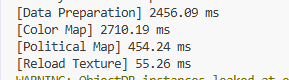
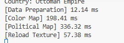
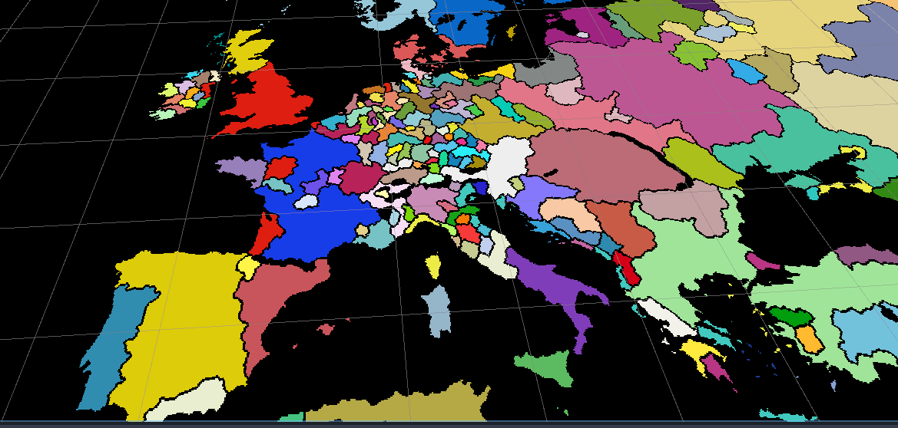
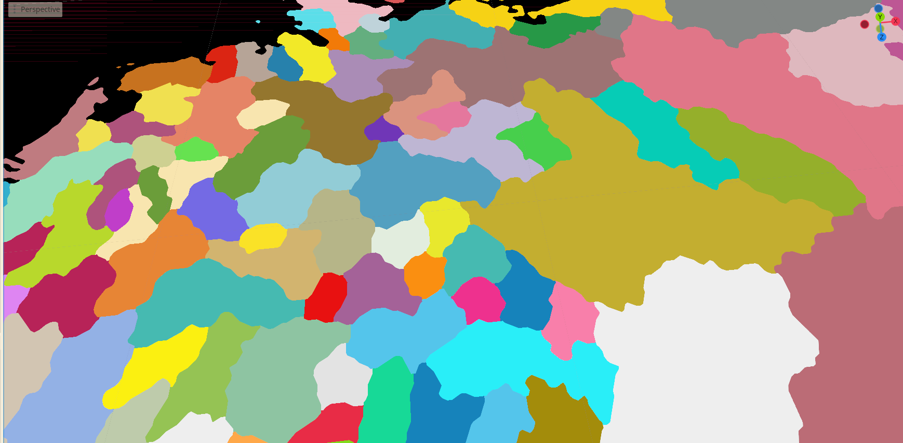
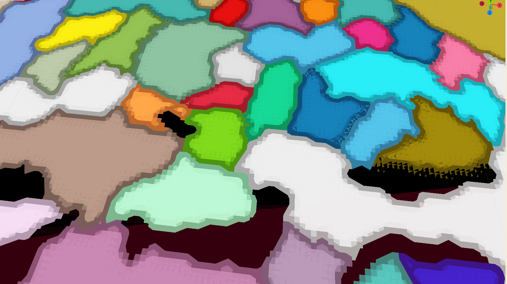
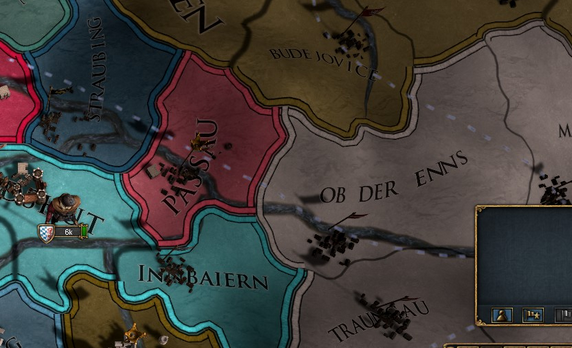
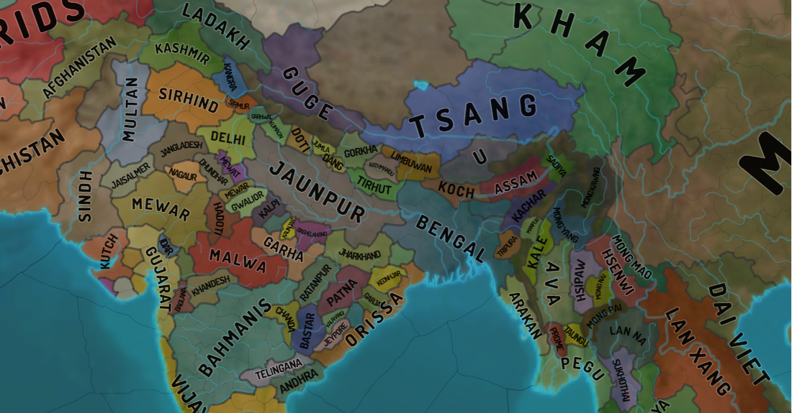
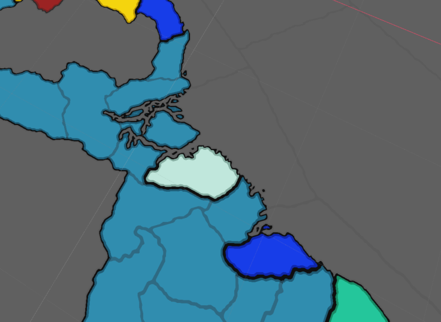
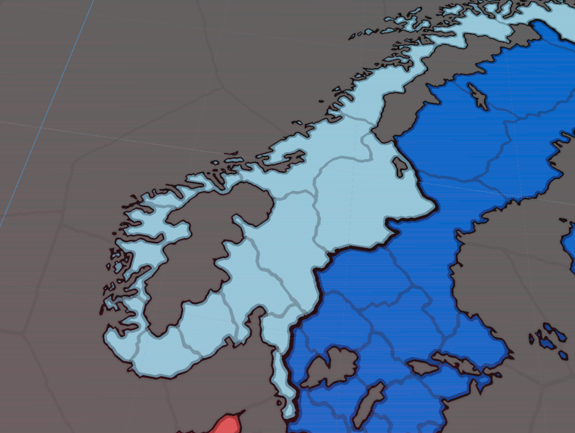
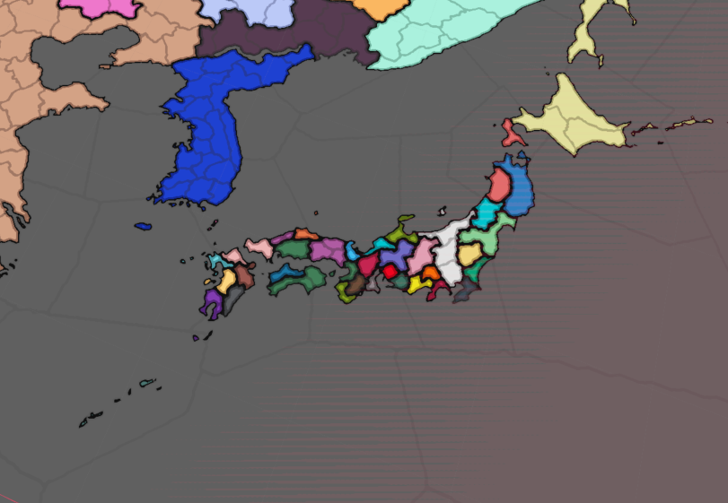

## 📂 Source Code

Can be found on GitHub [here](https://github.com/OneBogdan01/gs-map-editor).

---

## Overview

Grand strategy games like Europa Universalis IV use intricate political maps with thousands of irregular provinces and smooth borders that change as countries expand. I built a Godot C++ plugin to explore these systems and provide a starting point for game development/modding, focusing on creating smooth borders.

My primary goal was learning how to extend Godot with C++ (coming from simpler custom engines), while explore rendering techniques, editor tool integration, and Godot's extension architecture

**Key Achievement:** Implemented smooth border rendering using a texture indirection pipeline with HQX upscaling, adapted from Intel's Imperator: Rome rendering paper.

### 📚 [Article I wrote focusing on the rendering aspect (with code!)](https://tycro-games.github.io/posts/Grand-Strategy-Editor-using-Gdextension-in-Godot-with-C++/)

---

## Project Goals

Create a Godot plugin that could:

- Parse Europa Universalis IV's files to create a country and province database
- Render political maps with aesthetic borders that change in real-time
- Provide editor tools for modifying province ownership and country color
- Export back to EU4's file format

---

### Editor Functionality

In this project I also learned how to extend the editor in Godot. Below you can see how the user can change ownership of provinces, or their country color through the editor I made. The changes are saved in the file format that Europa Universalis 4 uses.

<video controls src="/assets/media/gs_map/export import.mp4" title="Province ownership editor demonstration"></video>
*Demonstration of province ownership editing and export/import functionality*


<video controls src="/assets/media/gs_map/change_color.mp4" title="Country color editing demonstration"></video>
*Changing the color of France in the editor, then running the game*

**To be clear, France is blue in the original file data.**

#### Data Structure Optimization

The main challenge for the editor functionality was figuring out how to store the data in such a way that I could display and change it without any hiccups. 

**Initial approach (arrays):** I started simple using arrays, which meant that sometimes I had to iterate to find element x of a country, then use it to iterate over another array to get element y. That resulted in **O(n³) complexity** which took a considerable amount of time:


*Very slow result with array-based approach*

**Optimized approach (dictionaries):** Profiling led to restructuring the data into dictionaries, and sometimes into dictionaries that refer to various aspects of the same country. This dramatically improved performance:


*Very fast result after optimization*

**Data initialization using lookup tables:**
```cpp
void CountryData::build_look_up_tables(const Array &province_data, const Array &country_data, const Array &country_color_data)
{
    // Initialize dictionaries for O(1) lookups
    country_id_to_country_name.clear();
    country_id_to_color.clear();
    country_name_to_color.clear();
    province_id_to_owner.clear();
    province_id_to_name.clear();
    
    // Build color lookup
    for (const Dictionary &dict : country_color_data)
    {
        country_name_to_color[dict["Name"]] = dict["Color"];
    }
    
    // Build country lookups
    for (const Dictionary &dict : country_data)
    {
        country_id_to_country_name[dict["Id"]] = dict["Name"];
        country_id_to_color[dict["Id"]] = country_name_to_color[dict["Name"]];
    }
    
    // Build province lookups
    for (const Dictionary &dict : province_data)
    {
        province_id_to_owner[dict["Id"]] = dict["Owner"];
        province_id_to_name[dict["Id"]] = dict["Name"];
    }
    
    UtilityFunctions::print("Parsed Provinces:", province_data.size());
    UtilityFunctions::print("Parsed Country Colors:", country_color_data.size());
    UtilityFunctions::print("Parsed Countries:", country_data.size());
}
```

#### Editor Display Data Caching

To avoid repeated lookups during UI rendering, I cache the display data:
```cpp
void CountryInspector::cache_display_data()
{
    display_data.clear();
    TypedDictionary<String, Color> country_name_color = country_data->get_country_name_to_color();
    TypedDictionary<String, String> country_id_name = country_data->get_country_id_to_country_name();
    
    for (const String &country_id : country_id_name.keys())
    {
        Dictionary country_info;
        String country_name = country_id_name[country_id];
        country_info["name"] = country_name;
        country_info["color"] = country_name_color.get(country_name, Color(1, 1, 1));
        country_info["provinces"] = country_data->get_country_provinces(country_id);
        display_data[country_id] = country_info;
    }
    
    UtilityFunctions::print_verbose("Display data for ", display_data.size());
}
```

#### Color Picker Implementation

The editor uses Godot's color picker with proper signal handling and memory management:
```cpp
ColorPicker *color_picker = memnew(ColorPicker);
PopupPanel *popup = memnew(PopupPanel);

// Setup and signal connections
color_picker->connect("color_changed", callable_mp(this, &CountryInspector::on_color_changed).bind(item, country_id));
popup->connect("popup_hide", callable_mp(this, &CountryInspector::on_color_picker_closed).bind(popup));

// Cleanup handlers
void CountryInspector::on_color_picker_closed(PopupPanel *popup)
{
    if (country_color_save.is_empty() == false)
    {
        country_data->export_color_data(country_color_save);
    }
    popup->queue_free();
}

void CountryInspector::on_context_menu_closed(PopupMenu *menu)
{
    menu->queue_free();
}
```

---

### Rendering

I believe that the **[article](https://tycro-games.github.io/posts/Grand-Strategy-Editor-using-Gdextension-in-Godot-with-C++/)** explains in a logical way how I arrived at the answer which I considered good enough visually. If you have any doubts please consult the paper, or the article. 

This is the core logic behind rendering fragment shader that renders political countries with no borders:

```glsl
shader_type canvas_item;

// texture with province IDs
uniform sampler2D lookup_map : filter_nearest;
// small texture with each provinces color, resolution is small (i.e. 256x256)
uniform sampler2D color_map : source_color, filter_nearest;

vec4 get_color(const in vec2 uv) {
    // UV in range [0-1]
    vec4 lookup = texture(lookup_map, uv);
    vec2 province_uv = lookup.rg;
    //get color from color map
    return texture(color_map, province_uv);
}

void fragment() {
    vec2 uv = UV;
    vec4 color = get_color(uv);
    
    COLOR = color;
}
```

This can also be visualized as:


*Complete overview of the rendering pipeline from province map to final output*

The output using EU4's files:


*Basic political map outputting province colors without borders*

### Borders

Rendering borders is very much like learning grand strategy games for the first time. There is no easy solution that provides a particularly great answer. So I would like to go over the ones that I considered to do, although I have not pursued them to finality.

#### Simple AA and edge detection

The first implementation is to try making smooth borders by using edge detection and adding some AA, it looks somehow promising, but not perfect either:


_Video with basic edges with AA applied_


_Screenshot of the political map with basic edge detection_

#### Upscaling using HQX

The main problem is that the effect is constrained by the texture resolution. It seemed logical to try to use an upscaler [shader][9]. Fortunately, this shader is used by Thomas Holtvedt's [open-source project](https://github.com/Thomas-Holtvedt/opengs) in Godot. HQX is a popular shader which is also used in other grand strategy map projects. The border can be smoothed out, at the cost of having any color values as the border itself.

**No** HQX:


_Political map with no borders_

**HQX applied:**


_HQX shader applied to the political map_

Combining simple edge detected borders with the upscaler shader was creating too many artifacts, especially when the color was using partial alpha values:


_Artifacts due to the alpha of the simple borders_

#### Generating meshes?

This is one of the techniques used in EU4! In fact, there are profiling results showing that rendering the border meshes takes most of the rendering, which you can find [here](https://www.hlsl.co.uk/blog/2018/7/18/what-can-we-learn-from-gpu-frame-captures-europa-universalis-4). This makes the technique quite complicated, requiring triangulation in order to achieve arbitrary shapes based on the province map. In addition, the fact that EU4 takes 90% from its render time for the borders according to the previous article makes it less appealing to pursue.


_Mesh Generated borders based on the neighboring countries from EU4_

#### SVG approach

I found a repo generating SVG maps based on the EU4 game data and textures as [oikoumene](https://github.com/primislas/eu4-svg-map). They only use vector based approaches to create borders between countries or provinces which is impressive in itself. It is an educated guess that EU4 uses a similar technique with multiple passes over the `province map` to create curves around the provinces and smooth them out in subsequent passes. My personal opinion is that they create a layered approach to their borders, so they might use a combination of techniques. 

This technique is ideal and their results speak for themselves. They are scalable and provide near identical results as the borders from the game in terms of shapes. The downside is the time needed to be invested in order to only generate the most basic province borders and the complexity that comes with that.


_Screenshot from Oikoumene samples_
#### Distance Field Texture and HQX


_Final technique used to render borders_

Given the complexity of vector approaches and the performance cost of mesh generation, I settled on a hybrid image-based technique. This approach breaks down if the map is very zoomed in, however, it looks good from most distances. The steps for this effect are the following:

- Generate Distance Field from `Color` + `Lookup` maps
- Sample the distance field to create the gradient
- Have an edge threshold, that when reached represents the border between countries (fill with border color)
- Use the HQX upscaler on the previous output to create smooth edges

> **Implementation Note:** A significant challenge was implementing the Jump Flood Algorithm for distance field generation. I was unable to get it working with Godot's `SubViewports`, though a compute shader approach might be more feasible for future work.

Adding province borders is trivial, as these will never change over the course of the game.

Here are a few screenshots with this effect on more exotic shapes:


_Smooth borders on large continental landmasses_


_Handling complex coastal geometry and fjords_


_Island chains and separated territories_


## References

### Godot & Compute Shaders

- [Godot Official Compute Shaders Documentation][1]
- [Compute Shader Textures Tutorial by NekoToArts][2]
- [Shader Storage Buffer Objects (SSBOs) Guide][3]
- [Godot Viewport as Texture Documentation][4]

### Map Rendering & Border Techniques

- [Intel Paper: Optimized Gradient Border Rendering in Imperator: Rome][5]
- [Simulating the EU4 Map in the Browser with WebGL][6]
- [Valve Paper: Improved Alpha-Tested Magnification (Distance Fields)][7]
- [Inigo Quilez: Introduction to Signed Distance Fields (Video)][8]
- [HQX Upscaling Filter (Shadertoy)][9]
- [Sobel Edge Detection Filter (Shadertoy)][10]
- [Unreal Engine Forum: Paradox Grand Strategy Game Borders Discussion][11]
- [Ben Golus: The Quest for Very Wide Outlines (Jump Flood Algorithm)][12]

### Alternative Border Approaches (Vector & Mesh-Based)

- [Anatomy of a Grand Strategy Game: Mesh Generation Devlog][13]
- [GameDev Stack Exchange: Rendering Province Borders in Unity][14]

[1]: https://docs.godotengine.org/en/stable/tutorials/shaders/compute_shaders.html
[2]: https://nekotoarts.github.io/blog/Compute-Shader-Textures
[3]: https://ktstephano.github.io/rendering/opengl/ssbos
[4]: https://docs.godotengine.org/en/stable/tutorials/shaders/using_viewport_as_texture.html
[5]: https://www.intel.com/content/dam/develop/external/us/en/documents/optimized-gradient-border-rendering-in-imperator-rome.pdf
[6]: https://nickb.dev/blog/simulating-the-eu4-map-in-the-browser-with-webgl/
[7]: https://steamcdn-a.akamaihd.net/apps/valve/2007/SIGGRAPH2007_AlphaTestedMagnification.pdf
[8]: https://www.youtube.com/watch?v=1b5hIMqz_wM
[9]: https://www.shadertoy.com/view/tsdcRM
[10]: https://www.shadertoy.com/view/4ss3Dr
[11]: https://forums.unrealengine.com/t/borders-like-paradox-grand-strategy-game/763968
[12]: https://bgolus.medium.com/the-quest-for-very-wide-outlines-ba82ed442cd9
[13]: https://medium.com/@squashfold/anatomy-of-a-grand-strategy-game-devlog-1-3962ba395ae4
[14]: https://gamedev.stackexchange.com/questions/183354/in-unity-how-can-i-render-borders-of-provinces-from-a-colored-province-map-in-a

## Behind the Scenes: Early Rendering Attempts

As a fun section, these are some of my attempts to implement the "basic" political rendering before getting it right. 


*Early iterations of the rendering pipeline*