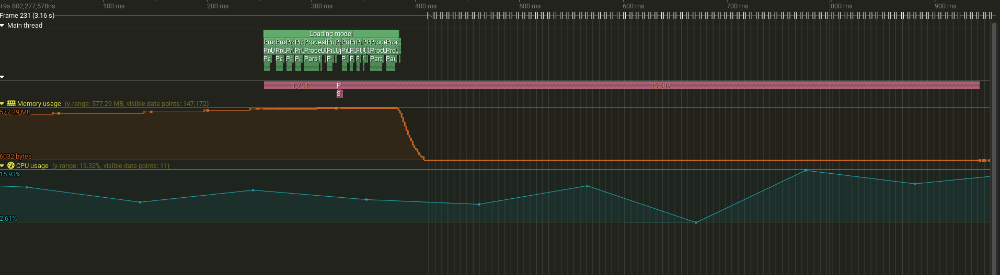
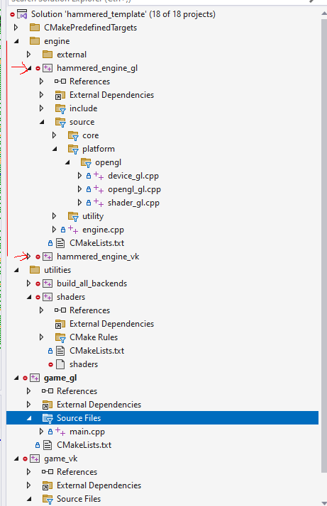

## 📂 Source Code

Can be found on GitHub **[here](https://github.com/OneBogdan01/hammered/tree/main)**.

---

## Overview

Hammered is my personal game engine for learning low-level engine systems, built as my playground to understand how engines work under the hood.

I explored both **OpenGL and Vulkan** rendering backends following **[vkguide.dev](https://vkguide.dev/)**, implementing basic model loading to understand the fundamentals. Currently, I'm focusing on **engine architecture**, redesigning the engine with a modular, data-driven approach inspired by the Bevy engine.

**Current Focus:** Restructuring the engine with a modular ECS-based architecture using [flecs](https://www.flecs.dev/flecs/).

---

## Multithreaded Logging System

📚 **[Read the full article](https://tycro-games.github.io/posts/Learning-Multithreading-With-A-Logger/)**

### Learning Multithreading

Multithreading is one of the most complex and elusive things I encountered as a game programmer, while logging is maybe the most fundamental debugging and profiling tool that I have used when I ran my first executable in C++. This idea was given to me by [Nick De Breuck](https://www.linkedin.com/in/nick-de-breuck-a9a207158/) when I asked him how to learn multithreading. The problem that this project aimed to solve was my own lack of experience using multithreading.

### Overview

The core idea behind the async logger is separating the act of queueing a message from writing it to a destination (console, file). The calling thread posts a message into a thread-safe queue and returns immediately, while a background worker thread processes the queue and writes to the sinks.

I started with a single-threaded logger as a baseline, then explored naive multithreading with a thread pool before arriving at the async approach. The article outlines the whole journey.

The main thread's `Log` function posts to the queue without blocking:

```cpp
void AsyncLogger::Log(Level level, std::string_view msg)
{
  HM_ZONE_SCOPED_N("AsyncLogger::Log");
  if (level < m_level)
    return;

  LogMsgView view {.level = level,
                   .loggerName = m_name,
                   .payload = msg,
                   .timestamp = clock::now(),
                   .threadId = std::this_thread::get_id()};

  if (pool)
  {
    pool->PostLog(shared_from_this(), view, m_overflowPolicy);
  }
}
```

The worker thread picks up messages from the queue and processes them:

```cpp
bool hm::log::LogThreadPool::ProcessNextMsg()
{
  HM_ZONE_SCOPED_N("ProcessLogMsg");
  AsyncMessage incoming_msg;
  m_queue.Dequeue(incoming_msg);

  switch (incoming_msg.type)
  {
    case AsyncMessageType::LOG:
      incoming_msg.asyncLogger->BackendSink(incoming_msg.msg);
      return true;
    case AsyncMessageType::FLUSH:
      incoming_msg.asyncLogger->BackendFlush();
      return true;
    case AsyncMessageType::TERMINATE:
      return false;
  }
  return true;
}
```


*Main thread (green) finishes logging calls quickly while the worker thread (pink) continues processing queued messages*

### Performance

| Approach              | Log::Debug Total | Log::Debug (mean) | Speedup  |
| --------------------- | ---------------- | ----------------- | -------- |
| Single-threaded       | 811 ms           | 47 µs             | baseline |
| Async Logger          | 70 ms            | 4 µs              | ~11×     |
| Buffered + ThreadPool | 29 ms            | 1.7 µs            | ~28×     |

The async logger reduces per-log overhead from 47 µs to 4 µs. The buffered approach is faster (~28×) but requires manual flushing and delayed output. The async logger (~11×) provides real-time output while keeping the main thread responsive.

### Reflection

I used [Tracy](https://github.com/wolfpld/tracy), an open-source profiler with great multithreading visualization, to compare each approach. The profiling data made it clear that the fastest solution (buffered thread pool) is not necessarily the best: it requires a clunky API and delayed output. The async logger provides a balance between performance and a better API.

The async logger also supports multiple producer and consumer threads, at the cost of losing message ordering. In my tests I used one producer (main thread) and one consumer (worker thread) to keep ordering intact.

---

## Cross-Platform Build System

📚 **[Read the full article](https://tycro-games.github.io/posts/Hammered-Cross-Platform-Game-Engine-CMake-Setup-copy/)**

### Overview

C++ lacks a standardized build system. When I learned Rust, its built-in package manager Cargo made dependency management feel way easier compared to C++. CMake is the closest equivalent, offering similar control at the cost of complexity, in the same spirit as C++ in my opinion.

I wanted to build an engine that compiles against two graphics backends (OpenGL and Vulkan) from a shared codebase. The challenge was structuring the CMake project so that common code and externals are shared, while backend-specific code and libraries get linked conditionally based on the target API.

The backends are very simple: for both, I render a triangle and the background is the result of a compute shader.

<video controls src="/assets/assets-2025-07-19/2025-07-19 18-00-20.mp4" title="Dual backend demonstration"></video>
*Switching between OpenGL and Vulkan backends at runtime*

### Architecture

The engine is built as two static libraries (`hammered_engine_gl` and `hammered_engine_vk`), each sharing common code but linking against their own platform-specific externals. A CMake utility function generates both backend executables from a single configuration flag.


*Visual Studio solution hierarchy showing the dual-backend organization*

The core of this approach is iterating over enabled backends and linking the right libraries for each:

```cmake
foreach(backend ${GAME_BACKENDS})
    set(engine_target "hammered_engine_${backend}")

    # Common libraries for all backends
    target_link_libraries(${engine_target}
        PUBLIC
            glm
    )

    # Backend-specific libraries
    if(backend STREQUAL "gl")
        target_link_libraries(${engine_target}
            PUBLIC
                glad
                imgui_opengl
        )
    elseif(backend STREQUAL "vk")
        target_link_libraries(${engine_target}
            PUBLIC
                vkbootstrap
                vma
                imgui_vulkan
        )
    endif()
endforeach()

```

### Reflection

Building this system taught me that while the dual-backend approach works, the architecture does not enforce encapsulation of dependencies. Everything links against one monolithic engine library rather than each subsystem linking only against what it needs. This realization is what motivated the current redesign toward a modular architecture inspired by [Bevy](https://bevy.org/). While researching Bevy, I also learned a little about the [Rust](https://rust-lang.org/) programming language, which influenced how I write C++ code.

Another important lesson from this period was that the Vulkan API was very difficult to build good architecture around. I accumulated significant technical debt by trying to make Vulkan "work", which contributed to my decision to restructure the engine in a modular fashion.

---

## Current Development

I'm restructuring the engine with a **modular ECS-based architecture** inspired by Bevy's design, using [flecs](https://www.flecs.dev/flecs/).

**Focus areas:**

- Data-driven system design
- Modular architecture patterns

In the previous architecture, I was coupling certain systems to others implicitly. To use the rendering aspect from the first build system as an example: what if I had no need for a renderer? It sounds extreme, but I can imagine a simulation with no rendering or that uses the command line for all its gameplay.

The new architecture would allow me to include only the modules needed for a particular application. My main reason for working on this engine is to be able to build anything I might be curious about, so this kind of design where I can mix and match each part of the engine is the right approach going forward.

I also started using CPM, a CMake utility for managing dependencies without git submodules. It brings some of the convenience of Rust's Cargo into the C++ workflow.

---

## Next steps

I chose flecs because it uses similar terminology to the Bevy engine, and I wanted to learn how a different ECS library behaves compared to entt, which I used in all my university projects. I plan to create a boid simulation to learn how the scheduler works in practice. In short, the scheduler plans which systems run in what order and allows for parallelization of systems with no dependencies. I am particularly excited to discover the performance gains from using multithreading in this way.

