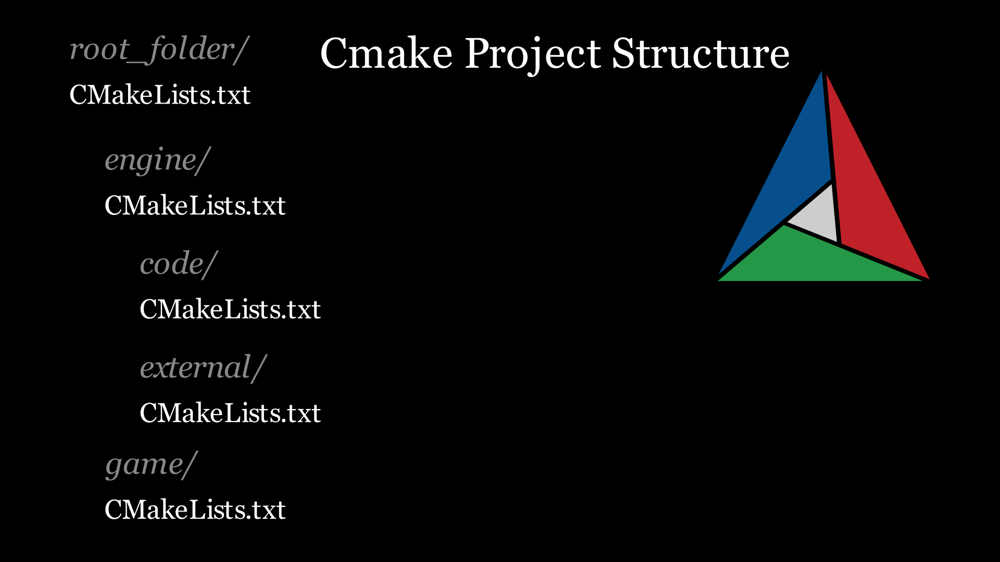

## 📂 Source Code

Can be found on GitHub **[here](https://github.com/OneBogdan01/hammered/tree/main)**.

---

## Overview

Hammered is my personal game engine for learning low-level engine systems, built as my playground to understand how engines work under the hood.

I explored both **OpenGL and Vulkan** rendering backends following **[vkguide.dev](https://vkguide.dev/)**, implementing basic model loading to understand the fundamentals. Currently, I'm focusing on **engine architecture**, redesigning the engine with a modular, data-driven approach inspired by the Bevy engine.

**Current Focus:** Restructuring the engine with a modular ECS-based architecture using [flecs](https://www.flecs.dev/flecs/).

---

## Cross-Platform Build System

📚 **[Read the full article](https://tycro-games.github.io/posts/Hammered-Cross-Platform-Game-Engine-CMake-Setup-copy/)**

### Overview

C++ suffers from the lack of a build system standard. There are many options, Cmake is considered "defacto" according to their website. I could try to reason about the importance of having a robust system for cross-platform, multiple graphics APIs, the desire or need to use various compilers in order to persuade the reader to believe that CMake is an important tool for any complex project. Instead, I would like to say that when I first started to learn the Rust programming language, they had a standard for everything, from the format standard to the build system they use, called `Cargo`. This system allowed me to manage my dependencies so easily, that it felt like cheating compared to C++. Despite that, I believe that CMake is the closest option to cargo and in the spirit of C++, it allows for great control at the cost of great complexity. Fortunately, learning can alleviate the latter problem.

### Goal

Simply put, I would like to have two backends (OpenGL/Vulkan) which are quite arbitrary and mainly make the architecture more complex by design. The goal behind the project is to handle both backends gracefully.

### What I Built

In the article I more or less go through all the steps needed to set-up a simple engine project that follows this diagram:

*Cmake project structure*

This would be the most simple approach to an engine. The engine itself is a static library which is bundled with its code and externals. This library is then linked with an executable which represents our realtime application, also known as the "game". The interesting aspect here, is the external libraries need to be linked depending on the graphics API used. 

### Opening and Closing the engine

As stated earlier I would like to be able to switch between OpenGL and Vulkan without closing the application explicitly as the user. Some games close the device and release all resources and start the restart the engine while saving the state that is not dependent on the graphics API. I found this quite

---

## Multithreaded Logging System

📚 **[Read the full article](https://tycro-games.github.io/posts/Learning-Multithreading-With-A-Logger/)**

### The Problem

Multithreading is one of the most complex and elusive things I encountered as a game programmer, while logging is maybe the most fundamental debugging and profiling tool that I have used right when I ran my first executable in C++. This idea of building a multithreaded logger was given to me by Nick De Breuck when I asked him the following question: "How to learn multithreading?"

### My Approach

- Producer-consumer pattern
- Message queue design decisions

### What I Built

- Thread-safe async logger
- Lock-free message queue
- Background I/O worker thread
- Multiple log levels/targets

### What I Learned

- [Multithreading concept you grasped]
- [Surprising challenge you encountered]
- [Performance insight]

---

## Current Development

I'm restructuring the engine with a **modular ECS-based architecture** inspired by Bevy's design.

**Focus areas:**

- Entity Component System implementation
- Data-driven system design
- Modular architecture patterns

[What specific problem are you solving with this redesign?]
[What have you learned so far in the process?]

*Dual backend build system supporting both OpenGL and Vulkan*

---

## What's Next

- Complete ECS architecture
- Resource management system
- [Add 1-2 more specific goals]

---

*This project is in active development as a learning exercise. I'm building it to understand engine architecture from the ground up.*
